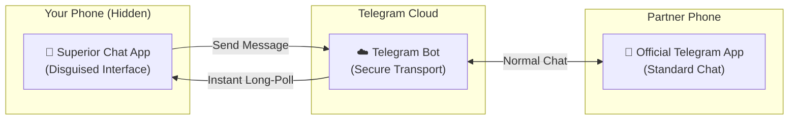
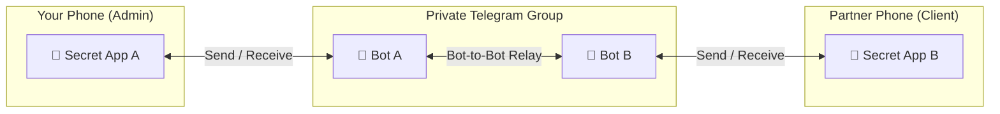

  <h1>Superior Chat</h1>
  
<strong>Private, Stealth-First Messaging Powered by Telegram Bot API</strong>

  
  

    
    
    
    
    
    
  

---

> [!IMPORTANT]
> **Superior Chat** is an Android app designed for maximum privacy. It looks and acts like a normal app on the outside, keeping your conversations **Completely Hidden** and leaving no trace on your personal device.

---

## 📑 Table of Contents
- [🌟 Overview](#overview)
- [📸 Screenshots](#screenshots)
- [🚀 Key Highlights](#features)
- [🤔 How It Works](#how-it-works)
- [🛠️ Instructions & Setup](#setup)
- [📚 Documentation](#documentation)
- [🙌 Acknowledgments](#acknowledgments)
- [⚖️ License](#license)

---

<h2 id="overview">🌟 Overview</h2>

Superior Chat solves a simple privacy challenge: **How to message someone secretly without keeping a visible chat app on your phone.**

Instead of operating custom backend servers, Superior Chat uses the highly reliable Telegram Bot API for messaging:
- 👤 **Option 1 (App to Telegram)**: User A chats in their official Telegram app via a dedicated bot, while User B chats inside the hidden Superior Chat app.
- 👥 **Option 2 (App to App)**: Both users chat directly inside the hidden Superior Chat app using Telegram's bot-to-bot communication in a private group.
- 🚫 **No Middleman Server**: Message histories are managed locally within the hidden app, while relying on Telegram's secure cloud for transport.

---

<h2 id="screenshots">📸 Screenshots</h2>

  
  &nbsp;
  
  &nbsp;
  

> 🖼️ Explore more screenshots in the [Chat App](docs/images/app), [Setup App](docs/images/setupapp) and [Flavors](docs/flavors/images/) directories.

---

<h2 id="features">🚀 Key Highlights</h2>

| Feature | What It Does | Why It's Great |
|---------|--------------|----------------|
| 👻 **Hidden or Disguised** | Has no app icon at all, or looks and works like a real Weather app. | Completely invisible to anyone looking at your phone. |
| 🔢 **Secret Passcodes** | Opens only when you dial a secret number (like `*#*#9131#*#*`), tap a Quick Settings tile, or search in the weather bar. | Cannot be opened normally from the app drawer. |
| 🎭 **Disguised Alerts** | Incoming message alerts look like normal carrier notifications or weather forecasts. | Complete privacy even when your screen lights up. |
| 🔄 **Two Ways to Chat** | Chat with someone using normal Telegram, or have both people use the secret app. | Maximum flexibility depending on what your partner prefers. |
| ⚡ **Free & Serverless** | Powered entirely by Telegram's free bot system with zero hosting costs. | 99.9% uptime, no monthly server fees, and no third-party tracking. |
| 📞 **Private Calls** | Secure voice and video calling built directly into the chat interface. | Call each other directly without exchanging phone numbers. |

👉 **[Click here to see Detailed Features](docs/Features.md)**

---

<h2 id="how-it-works">🤔 How It Works</h2>

Superior Chat speaks directly to Telegram without requiring any extra backend servers. You can connect in two different ways:

### Option 1: App to Telegram (One-Way Bridge)
You use the secret app on your phone, and your partner chats normally with your bot on Telegram.

---

### Option 2: App to App (Dual-Bot Bridge)
Both of you use the secret app. Telegram allows two bots to talk to each other inside a private group, so messages flow back and forth between both secret apps automatically!

---

<h2 id="setup">🛠️ Instructions & Setup</h2>

Superior Chat uses a **simple two-app system** so that no trace of installation or configuration stays on your phone:

1. **Setup App (`:setupapp`)**: A temporary helper used to install the hidden app and scan the setup QR code. Once configured, it tells you to uninstall it so your phone stays clean.
2. **Main App (`:app`)**: The secret chat app that stays hidden on the phone.

To install the app and set up your connection, check out our step-by-step guides:

👉 **[Download & Installation Guide](docs/Installation.md)** • **[Connection & Setup Guide](docs/SetupGuide.md)**

> 💬 **Need help, demo videos, or instruction guides?** Join our Telegram channel: **[@SuperiorChatGithub](https://t.me/SuperiorChatGithub)**

---

<h2 id="documentation">📚 Documentation</h2>

For detailed technical references, explore the dedicated documentation in this directory:

- 🏗️ **[Architecture](docs/Architecture.md)** — System topology, module breakdown, component dependency graphs, and source trees.
- ⚙️ **[Backend Mechanics](docs/Backend.md)** — Polling loops, network resilience, MediaSync upload/download engine, and background execution.
- ✨ **[Features & Capabilities](docs/Features.md)** — Comprehensive user-facing capabilities, gestures, disguises, and UI interactions.
- 📥 **[Installation Guide](docs/Installation.md)** — Download APKs, camouflage flavor installation, and building from source for developers.
- ⚙️ **[Setup Guide](docs/SetupGuide.md)** — Telegram bot setup, connection configuration, QR codes, and WebRTC calls.
- ⚠️ **[Notes & Disclaimers](docs/Notes.md)** — Important known limitations, threat models, and legal disclaimers.
- 📋 **[Version Changelogs](docs/Changelogs.md)** — Detailed version history, release notes, and feature updates.
- 📞 **[WebRTC Calling Engine](webrtc/README.md)** — Headless WebRTC calling architecture, JS bridge, security models, and self-hosting guides.
---
> [!IMPORTANT]
> For complete technical details on how the disguises, entry points, and fake notifications are implemented for each variant, please refer to the specific flavor documentation:
> - **[Captive Portal Details](docs/flavors/CaptivePortal.md)**
> - **[Weather Details](docs/flavors/FlavorWeather.md)**
> - **[Play Support Details](docs\flavors\PlaySupport.md)**
---

<h2 id="acknowledgments">🙌 Acknowledgments</h2>

| Asset / Project | Author | License |
|---|---|---|
| `weather` flavor UI design | **[WeatherAppUI](https://github.com/rudram837/WeatherAppUI)** by @rudram837 | Open Source |
| Sleeping Miku animated pixel art (`sleeping_miku.png`) | **[slubaru](https://addons.mozilla.org/en-US/firefox/addon/sleeping-miku-animated/)** / **[DomEgCZ](https://addons.mozilla.org/en-US/firefox/addon/sleeping-hatsune-miku-animated/)** | [CC BY-NC 3.0](https://creativecommons.org/licenses/by-nc/3.0/) |

> Hatsune Miku is a character owned by [Crypton Future Media](https://www.crypton.co.jp/). This project is non-commercial fan work compliant with the [Piapro Character License](https://piapro.net/license/pcl/summary).

---

<h2 id="license">⚖️ License</h2>

This project is licensed under the Apache License 2.0. 
For the full license text and terms of use, please view the **[LICENSE](LICENSE)** file.

 

  Built for privacy and discretion • Apache License 2.0 
  Built with ❤️ by <a href="https://gitlab.com/sandeshsahu">@sandeshsahu</a>

