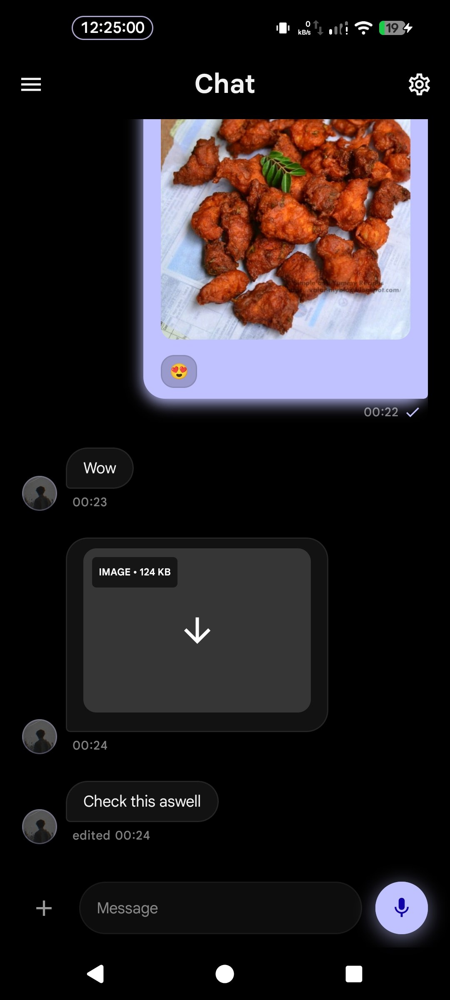
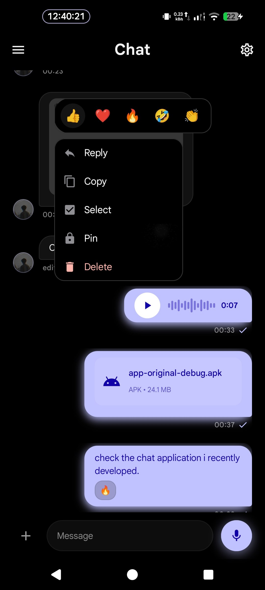
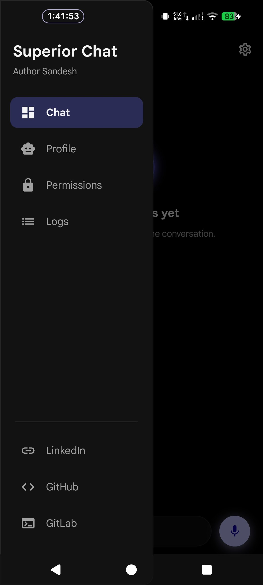
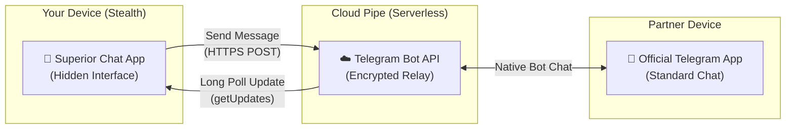

  <h1>Superior Chat</h1>
  
<strong>Private, Stealth-First Messaging Powered by Telegram Bot API</strong>

  
  

    
    
    
    
    
  

---

> [!IMPORTANT]
> **Superior Chat** is a stealth communication system for Android. It operates serverlessly by relaying end-to-end messages through the official Telegram Bot API, leaving **zero server footprint** while remaining completely **invisible** on the target device.

---

## 📑 Table of Contents
- [🌟 Overview](#overview)
- [📸 Screenshots](#screenshots)
- [🚀 Key Highlights](#features)
- [🤔 How It Works](#how-it-works)
- [🛠️ Instructions & Setup](#setup)
- [📚 Documentation](#documentation)
- [⚖️ License](#license)

---

<h2 id="overview">🌟 Overview</h2>

Superior Chat solves a unique privacy challenge: **How to chat securely without keeping a dedicated server or exposing a visible messaging app on your phone.**

Instead of operating custom backend servers, Superior Chat uses the highly reliable Telegram Bot API as an encrypted message pipe:
- 👤 **User A** chats directly inside their official Telegram application via a dedicated bot.
- 👤 **User B** chats inside the custom, hidden Superior Chat app.
- 🚫 **No Middleman Server**: All message histories and media are stored strictly locally on your device.

---

<h2 id="screenshots">📸 Screenshots</h2>

  
  &nbsp;
  
  &nbsp;
  

> 🖼️ Explore more screenshots in the [docs/images/app](docs/images/app) and [docs/images/setupapp](docs/images/setupapp) directories.

---

<h2 id="features">🚀 Key Highlights</h2>

| Feature | Description | Benefit |
|---------|-------------|---------|
| 👻 **Stealth App Disguise** | No launcher icon in stealth flavors; heavily disguised as native system components. | Invisible to casual snoopers & shoulder-surfers. |
| 🔑 **Secret Access Codes** | Unlocked exclusively via a secret dialer code (`*#*#9131#*#*`) or Quick Settings tile. | Cannot be opened normally from the app drawer. |
| 🛡️ **Camouflaged Alerts** | Notifications appear as harmless carrier/network system messages based on data states. | Complete privacy even when receiving alerts. |
| ⚡ **Serverless Transport** | Powered entirely by Telegram Bot API long-polling. | Zero hosting costs, 99.9% uptime, no tracking. |

👉 **[Click here to see Detailed Features](docs/Features.md)**

---

<h2 id="how-it-works">🤔 How It Works</h2>

Superior Chat acts as a silent client that speaks directly to the Telegram API.

---

<h2 id="setup">🛠️ Instructions & Setup</h2>

Superior Chat utilizes a **two-app setup system** to ensure zero residual metadata is left behind on the device.

1. **Setup App (`:setupapp`)**: A single-use configuration wizard used to scan QR codes or enter bot tokens. Once configured, it securely passes encrypted credentials to the main app via an RSA-2048 IPC handshake.
2. **Main App (`:app`)**: The core hidden chat application that stays on the device.

To install and set up the apps properly (including creating the Telegram Bot and generating the QR code), please read our complete setup guide:

👉 **[Click here for the Installation & Setup Guide](docs/Instructions.md)**

---

<h2 id="documentation">📚 Documentation</h2>

For detailed technical references, explore the dedicated documentation in this directory:

- 🏗️ **[Architecture](docs/Architecture.md)** — System topology, module breakdown, component dependency graphs, and source trees.
- ⚙️ **[Backend Mechanics](docs/Backend.md)** — Polling loops, network resilience, MediaSync upload/download engine, and background execution.
- ✨ **[Features & Capabilities](docs/Features.md)** — Comprehensive user-facing capabilities, gestures, disguises, and UI interactions.
- 📖 **[Installation Guide](docs/Instructions.md)** — Setup guide & building from source for developers.
- ⚠️ **[Notes & Disclaimers](docs/Notes.md)** — Important known limitations, threat models, and legal disclaimers.

---

<h2 id="license">⚖️ License</h2>

This project is licensed under the Apache License 2.0. 
For the full license text and terms of use, please view the **[LICENSE](LICENSE)** file.

 

  Built for privacy and discretion • Apache License 2.0 
  Built with ❤️ by <a href="https://gitlab.com/sandeshsahu">@sandeshsahu</a>

