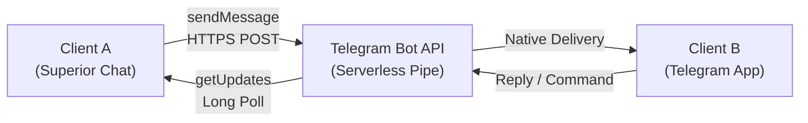
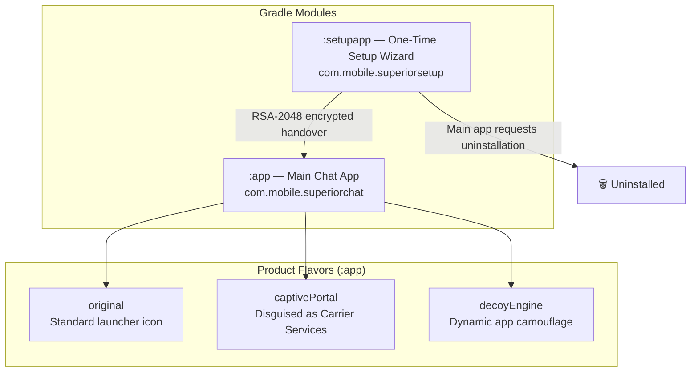
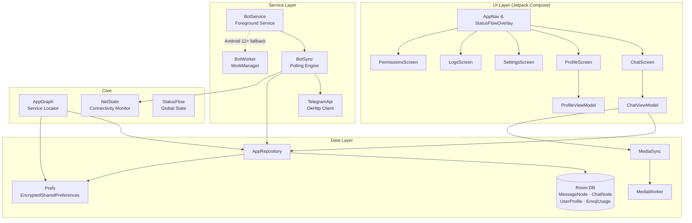
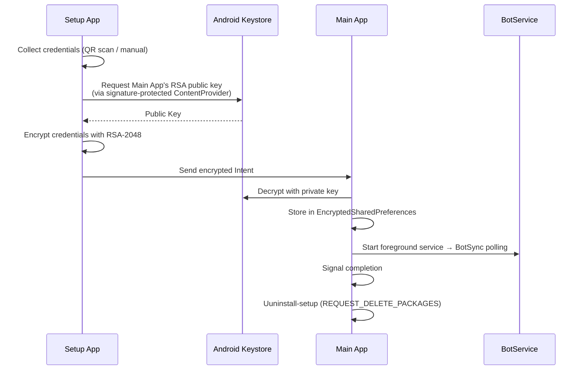
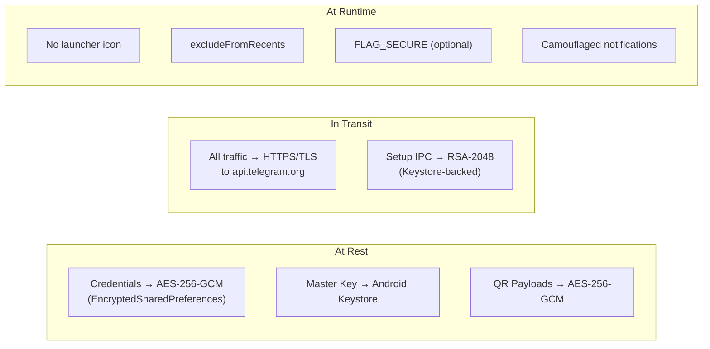

# Architecture

A stealth messaging app that uses Telegram Bot API as a serverless transport layer. Two users chat securely through a shared bot — one via this app, the other via native Telegram.

---

## Table of Contents
- [1. System Topology](#topology)
- [2. Modules & Flavors](#modules)
- [3. Component Architecture](#architecture)
- [4. Directory Structure](#directory)
- [5. Initialization Flow](#flow)
- [6. Stealth Access](#stealth)
- [7. Security Layers](#security)
- [8. Tech Stack](#stack)

---

<h2 id="topology">1. System Topology</h2>



> Both users chat with each other through a shared Telegram bot. The bot is just a relay — it stores nothing. All data lives locally on the device.

---

<h2 id="modules">2. Modules & Flavors</h2>

The project compiles into multiple variants from a shared codebase using Android Gradle product flavors.



| Module | Package | Purpose |
|--------|---------|---------|
| `:app` | `com.mobile.superiorchat` | Core chat app — messaging, media, stealth, background sync |
| `:setupapp` | `com.mobile.superiorsetup` | Temporary wizard — collects credentials, hands off to `:app`, which then prompts the user to uninstall it |

| Flavor | Identity | Stealth Level |
|--------|----------|---------------|
| `original` | Standard app with launcher icon | None (dev/debug) |
| `captivePortal` | Disguised as "Carrier Services" | Hidden icon, camouflaged notifications, QS tile access |
| `decoyEngine` | Impersonates installed system apps | Dynamic notification spoofing, DecoyActivity tap targets |

---

<h2 id="architecture">3. Component Architecture</h2>



---

<h2 id="directory">4. Directory Structure</h2>

### 4.1 Main App (`:app`)

```
app/src/main/java/com/mobile/superiorchat/
├── SuperiorChatApp.kt              # Application initialization
├── MainActivity.kt                 # Entry point & intent handling
│
├── bot/                            # Telegram API integration
│   ├── TelegramApi.kt              # OkHttp client, rate limiting, all Bot API methods
│   ├── ApiData.kt                  # Serialization data classes (Update, Message, etc.)
│   └── BotSync.kt                  # Long-polling loop, intruder filtering, queue flushing
│
├── core/                           # App architecture & state
│   ├── AppGraph.kt                 # Service locator (Prefs, DB, Repository singletons)
│   ├── LocalDb.kt                  # Room database config & migrations
│   ├── Converters.kt               # Room TypeConverters for enums
│   ├── KeyProvider.kt              # ContentProvider exposing RSA public key for setup IPC
│   ├── NetState.kt                 # Connectivity monitoring via StateFlow
│   ├── ServiceCore.kt              # Foreground service lifecycle & WorkManager fallback
│   └── StatusFlow.kt               # Global sync & active media transfer state management
│
├── data/                           # Persistence
│   ├── Prefs.kt                    # EncryptedSharedPreferences (AES-256-GCM)
│   ├── dao/                        # Room DAOs
│   │   ├── EmojiDao.kt
│   │   ├── MessageDao.kt
│   │   ├── ProfileDao.kt
│   │   └── ThreadDao.kt
│   ├── entity/                     # Room entities
│   │   ├── ChatNode.kt             # Conversation metadata
│   │   ├── EmojiUsage.kt           # Reaction frequency tracking
│   │   ├── MessageNode.kt          # Message with status tracking
│   │   ├── MessageStatus.kt        # Enum: QUEUED, SENDING, SENT, FAILED
│   │   └── UserProfile.kt          # Cached target chat info
│   └── repository/
│       └── AppRepository.kt        # Mediates between DAOs & business logic
│
├── media/                          # Media handling
│   ├── AudioPlayer.kt              # Voice note playback
│   ├── AudioRecorder.kt            # Voice note recording (M4A/AMR)
│   ├── LocalDirs.kt                # Dynamic media directory management (flavor aware)
│   ├── MediaSync.kt                # Concurrent-safe transfers + WorkManager
│   └── MediaWorker.kt              # WorkManager CoroutineWorker
│
├── service/                        # Background services
│   ├── BotService.kt               # Foreground Service wrapping BotSync
│   └── BotWorker.kt                # WorkManager fallback for background syncing
│
├── theme/
│   └── Theme.kt                    # Material Design 3 colors, typography, shapes
│
├── ui/                             # Jetpack Compose screens
│   ├── AppNav.kt                   # Navigation drawer & screen routing
│   ├── ChatScreen.kt               # Chat interface with message bubbles
│   ├── ChatViewModel.kt            # Chat state management
│   ├── LogsScreen.kt               # Diagnostic logs viewer
│   ├── MainViewModel.kt            # Global app state
│   ├── PermissionsScreen.kt        # Runtime permission handler
│   ├── SettingsScreen.kt           # Credential config & toggles
│   ├── profile/                    # Profile feature package
│   │   ├── ProfileScreen.kt        # Bot's own profile display (separated from receiver's profile)
│   │   └── ProfileViewModel.kt     # Profile editing & photo state
│   └── components/                 # Reusable UI components
│       ├── AttachMenu.kt           # Attachment bottom sheet
│       ├── ChatInputBox.kt         # Text input with recording & attachments
│       ├── QrScanner.kt            # QR code scanner
│       ├── ScrollEvent.kt          # Scroll state utility
│       ├── UIModifiers.kt          # Custom modifiers (glow, bounce, etc.)
│       ├── bubbles/                # Message rendering components
│       │   ├── AudioBubble.kt      # Waveform visualization & playback
│       │   ├── DocumentBubble.kt   # Document attachment rendering
│       │   ├── MediaBubble.kt      # Photo/Video visualization
│       │   └── MessageBubble.kt    # Standard text wrapper & orchestration
│       ├── media/                  # Media handling UI
│       │   ├── FileExplorer.kt     # Hierarchical file browser
│       │   ├── GalleryGrid.kt      # Media grid with album filtering
│       │   ├── ImageCropper.kt     # Photo cropping utility
│       │   ├── MediaPicker.kt      # Media selection orchestrator
│       │   └── MediaViewer.kt      # Full-screen media viewer
│       ├── popups/                 # Modals and Dialogs
│       │   ├── MessagePopups.kt    # Message interactions (Context menu, emojis)
│       │   ├── StatusPill.kt       # Future-proof global sync & transfer state pill
│       │   └── SystemPopups.kt     # Global app dialogs (Warnings, credentials)
│       └── profile/                # Profile UI fragments
│           ├── EditInfoSheet.kt    # Modal sheet for editing profile details
│           ├── PartnerProfile.kt   # Reusable profile header card
│           └── ProfileSettings.kt  # Danger zone & profile settings
│
└── utils/                          # Cross-cutting utilities
    ├── AppLog.kt                   # Thread-safe diagnostic logger
    ├── BootReceiver.kt             # Starts service on device boot
    ├── FileUtils.kt                # File type resolution & IO
    ├── Permissions.kt              # Universal permission state & rationale handler
    ├── QrManager.kt                # QR code generation & AES decryption
    ├── Security.kt                 # RSA/AES encryption (Keystore-backed)
    └── Validator.kt                # Regex patterns for bot token/chat ID
```

### 4.2 Flavor Source Sets

```
app/src/
├── original/                       # Standard flavor (dev/debug)
│   ├── AndroidManifest.xml
│   ├── java/.../bot/
│   │   └── Notifier.kt             # Standard notification implementation
│   └── res/                        # Launcher icons, strings
│
├── captivePortal/                  # Carrier Services disguise
│   ├── AndroidManifest.xml
│   ├── java/.../bot/
│   │   └── Notifier.kt             # Carrier-specific camouflaged notifications
│   └── res/                        # Disguised icons, camo_strings
│
└── decoyEngine/                    # Shared camouflage library
    ├── AndroidManifest.xml
    └── java/.../
        ├── camouflage/
        │   ├── engine/
        │   │   ├── Manager.kt       # Resolves profile states → decoy data
        │   │   ├── Notifier.kt      # Builds notifications from DecoyData
        │   │   └── TileService.kt   # Quick Settings tile handler
        │   ├── models/
        │   │   └── Profiles.kt      # Profile sealed classes & state enums
        │   └── ui/
        │       ├── DecoyActivity.kt  # Innocuous screen shown on notification tap
        │       └── TileActivity.kt   # QS tile launch activity
        └── utils/
            ├── CodeReceiver.kt      # Dialer interceptor (*#*#9131#*#*)
            └── TelephonyUtils.kt    # SIM carrier name retrieval for spoofing
```

### 4.3 Setup App (`:setupapp`)

```
setupapp/src/main/java/com/mobile/superiorsetup/
├── MainActivity.kt                  # Setup wizard entry point
├── core/
│   ├── AppManager.kt                # APK extraction & IPC intent handover
│   ├── Config.kt                    # Encrypted config storage (setup only)
│   ├── QrManager.kt                 # QR scanning & encryption logic
│   ├── Security.kt                  # AES/GCM & RSA setup encryption
│   └── Validator.kt                 # Input validation constraints
├── theme/
│   └── Theme.kt
└── ui/
    ├── Screens.kt                   # Setup wizard screens
    └── components/
        ├── GalleryGrid.kt           # Media gallery for QR import
        ├── Popups.kt                # Setup dialogs
        └── QrScanner.kt             # Camera-based QR scanner
```

---

<h2 id="flow">5. Initialization Flow</h2>



---

<h2 id="stealth">6. Stealth Access</h2>

The app has **no launcher icon** in stealth flavors. Access methods:

| Method | Flavor | How |
|--------|--------|-----|
| **Dialer Code** | All (via decoyEngine) | Dial `*#*#9131#*#*` → `CodeReceiver` intercepts → launches `MainActivity` |
| **QS Tile** | captivePortal | ON, OFF, ON and HOLD Quick Settings tile → `TileActivity` → `MainActivity` |
| **Boot** | All | `BootReceiver` starts `BotService` on `BOOT_COMPLETED` |
| **Launcher** | original only | Standard app drawer icon (debug/dev use) |

---

<h2 id="security">7. Security Layers</h2>



| Layer | Mechanism | Scope |
|-------|-----------|-------|
| **Credential Storage** | AES-256-GCM via EncryptedSharedPreferences | Bot token, chat ID, settings |
| **Setup IPC** | RSA-2048, signature-protected ContentProvider | One-time credential transfer |
| **QR Codes** | AES-256-GCM (static key) | Prevents accidental scanning |
| **Transport** | Standard HTTPS/TLS to Telegram | All network communication |
| **Notifications** | Dynamic spoofing (carrier/system app mimicry) | captivePortal & decoyEngine flavors |
| **Screen** | FLAG_SECURE (user toggle) | Prevents screenshots |

---

<h2 id="stack">8. Tech Stack</h2>

| Layer | Technology |
|-------|------------|
| **UI** | Jetpack Compose, Material Design 3 |
| **Architecture** | MVVM, StateFlow, Service Locator (AppGraph) |
| **Networking** | OkHttp, Kotlinx Serialization, Telegram Bot API |
| **Database** | Room (SQLite) |
| **Background** | Foreground Service + WorkManager fallback |
| **Media** | Coil (image loading), MediaSync (transfer engine) |
| **Security** | Android Keystore, AES-256-GCM, RSA-2048 |
| **Build** | Gradle product flavors, KSP |

---

<p align="center">
  <sub>Built with ❤️ by <a href="https://gitlab.com/sandeshsahu">@sandeshsahu</a></sub>
</p>