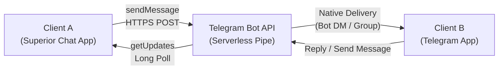
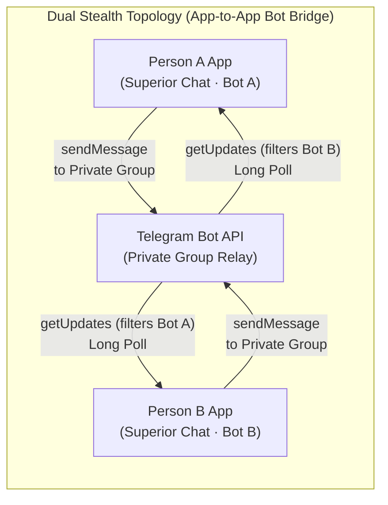
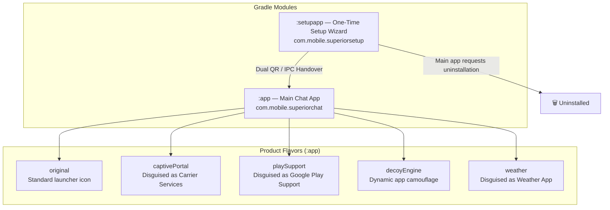
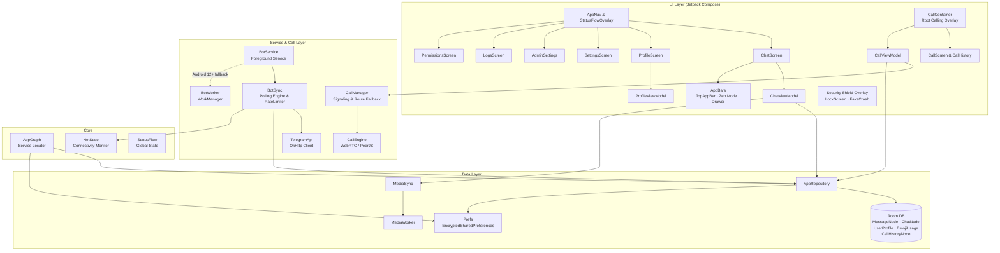
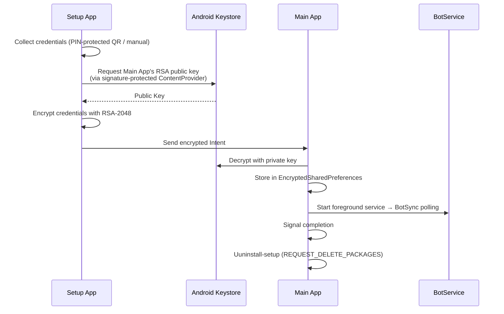
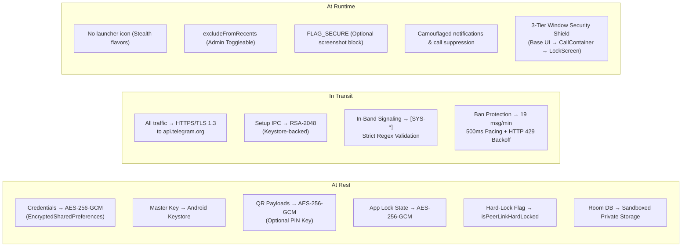

# Architecture

A stealth messaging app that uses Telegram Bot API as a serverless transport layer. Two users chat securely through a shared bot — one via this app, the other via native Telegram.

---

## Table of Contents
- [1. System Topology](#topology)
- [2. Modules & Flavors](#modules)
- [3. Component Architecture](#c_architecture)
- [4. WebRTC Architecture](#webrtc)
- [5. Directory Structure](#directory)
- [6. Initialization Flow](#flow)
- [7. Stealth Access](#stealth)
- [8. Security Layers](#security)
- [9. Tech Stack](#stack)

---

<h2 id="topology">1. System Topology</h2>

Superior Chat supports two distinct communication topologies depending on the deployment configuration:

### 1.1 Standard Mode (App-to-Telegram / 1-Way Stealth)
Client A operates the disguised Superior Chat application, while Client B uses the native Telegram messenger. All communications are relayed via Telegram Bot API through a direct Bot DM or a multi-user group chat.



### 1.2 Dual Stealth Mode (App-to-App Bot Bridge)
Both users operate Superior Chat with stealth disguises. Person A (using Bot A) and Person B (using Bot B) communicate inside a dedicated Telegram private group (`chat_id < 0`) utilizing Telegram's official Bot-to-Bot communication capability.



> **Zero Cloud Storage**: Both topologies operate completely serverless without any central database or proprietary backend. Telegram servers act purely as an encrypted transit pipe; all messages, keys, media, and call histories are stored strictly on the local Android device.

---

<h2 id="modules">2. Modules & Flavors</h2>

The project compiles into multiple variants from a shared codebase using Android Gradle product flavors.



| Module | Package | Purpose |
|--------|---------|---------|
| `:app` | `com.mobile.superiorchat` | Core chat app — messaging, media, stealth, WebRTC calls, dual-role (Client / Admin) |
| `:setupapp` | `com.mobile.superiorsetup` | Setup wizard — provisions credentials, guided BotFather creation, dual QR generation (Client & Admin pairing), then hands off to `:app` |

| Flavor | Identity | Stealth Level |
|--------|----------|---------------|
| `original` | Standard app with launcher icon | None (dev/debug) |
| `captivePortal` | Disguised as "Carrier Services" | See [CaptivePortal.md](flavors/CaptivePortal.md) for details. |
| `playSupport` | Disguised as "Google Play Support" | See [PlaySupport.md](flavors/PlaySupport.md) for details. |
| `decoyEngine` | Impersonates installed system apps | Dynamic notification spoofing, DecoyActivity tap targets |
| `weather` | Disguised as "Weather" App | See [FlavorWeather.md](flavors/FlavorWeather.md) for details. |

---

<h2 id="c_architecture">3. Component Architecture</h2>



---

<h2 id="webrtc">4. WebRTC Architecture</h2>

The real-time audio and video call infrastructure operates independently from the main Telegram transport layer.

For detailed sequence diagrams, signaling flow, and ICE negotiation architectures, see the dedicated WebRTC documentation.

👉 **[View WebRTC Architecture](../webrtc/docs/Architecture.md)**

---

<h2 id="directory">5. Directory Structure</h2>

### 5.1 Main App (`:app`)

```
app/src/main/java/com/mobile/superiorchat/
├── SuperiorChatApp.kt              # Application initialization
├── MainActivity.kt                 # Entry point & intent handling
├── TransparentActivity.kt          # used via Fake Crash Decoy popup
│
├── bot/                            # Telegram API integration
│   ├── TelegramApi.kt              # OkHttp client, rate limiting, all Bot API methods
│   ├── ApiData.kt                  # Serialization data classes (Update, Message, etc.)
│   └── BotSync.kt                  # Long-polling loop, intruder filtering, queue flushing
│
├── core/                           # App architecture & state
│   ├── AppGraph.kt                 # Service locator (Prefs, DB, Repository singletons)
│   ├── LocalDb.kt                  # Room database config & migrations
│   ├── Converters.kt               # Room TypeConverters for enums
│   ├── KeyProvider.kt              # ContentProvider exposing RSA public key for setup IPC
│   ├── NetState.kt                 # Connectivity monitoring via StateFlow
│   ├── ServiceCore.kt              # Foreground service lifecycle & WorkManager fallback
│   ├── StatusFlow.kt               # Global sync & active media transfer state management
│   └── call/                       # WebRTC engine & signaling
│       ├── CallEngine.kt           # PeerJS WebRTC orchestration
│       └── CallManager.kt          # Signaling server routing & fallback
│
├── data/                           # Persistence
│   ├── Prefs.kt                    # EncryptedSharedPreferences (AES-256-GCM)
│   ├── dao/                        # Room DAOs
│   │   ├── CallHistoryDao.kt
│   │   ├── EmojiDao.kt
│   │   ├── MessageDao.kt
│   │   ├── ProfileDao.kt
│   │   └── ThreadDao.kt
│   ├── entity/                     # Room entities
│   │   ├── CallHistoryNode.kt      # Call logs & metadata
│   │   ├── ChatNode.kt             # Conversation metadata
│   │   ├── EmojiUsage.kt           # Reaction frequency tracking
│   │   ├── MessageNode.kt          # Message with status tracking
│   │   ├── MessageStatus.kt        # Enum: QUEUED, SENDING, SENT, FAILED
│   │   └── UserProfile.kt          # Cached target chat info
│   └── repository/
│       └── AppRepository.kt        # Mediates between DAOs & business logic
│
├── media/                          # Media handling
│   ├── AudioPlayer.kt              # Voice note playback
│   ├── AudioRecorder.kt            # Voice note recording (M4A/AMR)
│   ├── LocalDirs.kt                # Dynamic media directory management (flavor aware)
│   ├── MediaSync.kt                # Concurrent-safe transfers + WorkManager
│   ├── MediaWorker.kt              # WorkManager CoroutineWorker
│   └── VaultManager.kt             # Handles media encryption and Vault UI bridging
│
├── service/                        # Background services
│   ├── BotService.kt               # Foreground Service wrapping BotSync
│   └── BotWorker.kt                # WorkManager fallback for background syncing
│
├── theme/
│   └── Theme.kt                    # Material Design 3 colors, typography, shapes
│
├── ui/                             # Jetpack Compose screens
│   ├── AdminSettings.kt            # Admin configuration (PeerLink, Admin Mode, Background Calls, Recents)
│   ├── AppNav.kt                   # Navigation drawer & screen routing
│   ├── AppScreen.kt                # App information and overview hub
│   ├── ChatScreen.kt               # Chat interface with message bubbles
│   ├── ChatViewModel.kt            # Chat state management
│   ├── GhostSkeleton.kt            # Skeleton loading animation
│   ├── LockScreen.kt               # lockscreen design
│   ├── LogsScreen.kt               # Diagnostic logs viewer
│   ├── MainViewModel.kt            # Global app state
│   ├── PermissionsScreen.kt        # Runtime permission handler
│   ├── SettingsScreen.kt           # Credential config & advanced toggles
│   ├── call/                       # WebRTC Call UI
│   │   ├── CallContainer.kt        # Root overlay hosting active CallScreen, PiP & dialogs
│   │   ├── CallHistory.kt          # Call logs interface
│   │   ├── CallScreen.kt           # Immersive calling interface
│   │   └── CallViewModel.kt        # Call state management
│   ├── components/                 # Reusable UI components
│   │   ├── AppBars.kt              # Top app bar, navigation drawer trigger, Zen Mode action
│   │   ├── AttachMenu.kt           # Attachment bottom sheet
│   │   ├── ChatInputBox.kt         # Text input with recording & attachments
│   │   ├── QrScanner.kt            # QR code scanner
│   │   ├── ScrollEvent.kt          # Scroll state utility
│   │   ├── UIModifiers.kt          # Custom modifiers (glow, bounce, etc.)
│   │   ├── bubbles/                # Message rendering components
│   │   │   ├── AudioBubble.kt      # Waveform visualization & playback
│   │   │   ├── DocumentBubble.kt   # Document attachment rendering
│   │   │   ├── MediaBubble.kt      # Photo/Video visualization
│   │   │   └── MessageBubble.kt    # Standard text wrapper & orchestration
│   │   ├── media/                  # Media handling UI
│   │   │   ├── FileExplorer.kt     # Hierarchical file browser
│   │   │   ├── GalleryGrid.kt      # Media grid with album filtering
│   │   │   ├── ImageCropper.kt     # Photo cropping utility
│   │   │   ├── MediaPicker.kt      # Media selection orchestrator
│   │   │   └── MediaViewer.kt      # Full-screen media viewer
│   │   ├── popups/                 # Modals and Dialogs
│   │   │   ├── AdminDialogs.kt     # Admin confirmation & configuration dialogs
│   │   │   ├── AnimPreviews.kt     # Stealth access visual interaction previews
│   │   │   ├── MessagePopups.kt    # Message interactions (Context menu, emojis)
│   │   │   ├── PopupDialogs.kt     # Centralized animated dialog catalog
│   │   │   ├── StatusPill.kt       # Future-proof global sync & transfer state pill
│   │   │   └── SystemPopups.kt     # Global app dialogs (Warnings, credentials)
│   │   ├── profile/                # Profile UI fragments
│   │   │   ├── EditInfoSheet.kt    # Modal sheet for editing profile details
│   │   │   ├── PartnerProfile.kt   # Reusable profile header card
│   │   │   └── ProfileSettings.kt  # Profile settings toggles
│   │   └── vault/                  # Media Vault UI
│   │       └── VaultScreen.kt      # Fake gallery/vault decoy screen
│   └── profile/                    # Profile feature package
│       ├── ProfileScreen.kt        # Bot's own profile display
│       └── ProfileViewModel.kt     # Profile editing & photo state
│
└── utils/                          # Cross-cutting utilities
    ├── AppLog.kt                   # Thread-safe diagnostic logger
    ├── BootReceiver.kt             # Starts service on device boot
    ├── FileUtils.kt                # File type resolution & IO
    ├── Permissions.kt              # Universal permission state & rationale handler
    ├── QrManager.kt                # QR code generation & AES decryption
    ├── Security.kt                 # RSA/AES encryption (Keystore-backed)
    └── Validator.kt                # Regex patterns for bot token/chat ID
```

### 5.2 Flavor Source Sets

```
app/src/
├── original/                       # Standard flavor (dev/debug)
│   ├── AndroidManifest.xml
│   ├── java/.../bot/
│   │   └── Notifier.kt             # Standard notification implementation
│   └── res/                        # Launcher icons, strings
│
├── captivePortal/                  # Carrier Services disguise
│   ├── AndroidManifest.xml
│   ├── java/.../bot/
│   │   └── Notifier.kt             # Carrier-specific camouflaged notifications
│   └── res/                        # Disguised icons, camo_strings
│
├── playSupport/                    # Google Play Support disguise
│   ├── AndroidManifest.xml
│   ├── java/.../bot/
│   │   └── Notifier.kt             # Play Store promotional spoofed notifications
│   └── res/                        # Play Support icons, dynamic ad strings
│
├── weather/                        # Weather App camouflage
│   ├── AndroidManifest.xml         # taskAffinity isolation, Intent interception
│   ├── java/.../                   # Authentic Weather UI logic, Retrofit integrations
│   └── res/                        # Authentic adaptive icons, dynamic live camo_strings
│
└── decoyEngine/                    # Shared camouflage library
    ├── AndroidManifest.xml
    └── java/.../
        ├── camouflage/
        │   ├── engine/
        │   │   ├── Manager.kt       # Resolves profile states → decoy data
        │   │   ├── Notifier.kt      # Builds notifications from DecoyData
        │   │   └── TileService.kt   # Quick Settings tile handler
        │   ├── models/
        │   │   └── Profiles.kt      # Profile sealed classes & state enums
        │   └── ui/
        │       ├── DecoyActivity.kt  # Innocuous screen shown on notification tap
        │       └── TileActivity.kt   # QS tile launch activity
        └── utils/
            ├── CodeReceiver.kt      # Dialer interceptor (*#*#9131#*#*)
            └── TelephonyUtils.kt    # SIM carrier name retrieval for spoofing
```

### 5.3 Setup App (`:setupapp`)

```
setupapp/src/main/java/com/mobile/superiorsetup/
├── MainActivity.kt                  # Setup wizard entry point
├── core/
│   ├── AppManager.kt                # APK extraction & IPC intent handover
│   ├── Config.kt                    # Encrypted config storage (setup only)
│   ├── QrManager.kt                 # QR scanning & encryption logic
│   ├── Security.kt                  # AES/GCM & RSA setup encryption
│   └── Validator.kt                 # Input validation constraints
├── theme/
│   └── Theme.kt
├── ui/
│   ├── AdminScreens.kt             # Admin BotFather guided setup & Group Bot setup wizard
│   ├── ClientScreens.kt            # Partner client pairing & QR scanner workflow
│   ├── Screens.kt                  # Base setup navigation & landing screen
│   └── components/
│       ├── GalleryGrid.kt          # Media gallery for QR import
│       ├── PopupDialogs.kt         # Animated setup alert & confirmation dialogs
│       ├── Popups.kt               # Setup dialogs
│       ├── QrScanner.kt            # Camera-based QR scanner
│       └── UIModifiers.kt          # Custom modifiers (glow, bounce, etc.)
```

---

<h2 id="flow">6. Initialization Flow</h2>



---

<h2 id="stealth">7. Stealth Access</h2>

The app has **no launcher icon** in stealth flavors. Access methods:

| Method | Flavor | How |
|--------|--------|-----|
| **Dialer Code** | All (via decoyEngine) | Dial `*#*#9131#*#*` → `CodeReceiver` intercepts → launches `MainActivity` (or recovers in-progress call) |
| **QS Tile** | captivePortal, playSupport | Tapping QS tile opens stealth screen; if in active call, restores call to front (`FLAG_ACTIVITY_REORDER_TO_FRONT` + `ACTION_MAXIMIZE_PIP`) |
| **App Search** | weather | See [FlavorWeather.md](flavors/FlavorWeather.md) for interception details |
| **Fake Crash Decoy** | All | Invokes `TransparentActivity` displaying an authentic Android crash popup; double-tap bypasses to real app |
| **Boot** | All | `BootReceiver` starts `BotService` on `BOOT_COMPLETED` |
| **Launcher** | original, weather | Standard app drawer icon (debug/dev or weather disguise) |

---

<h2 id="security">8. Security Layers</h2>



| Layer | Mechanism | Scope |
|-------|-----------|-------|
| **Credential Storage** | AES-256-GCM via EncryptedSharedPreferences | Bot token, chat ID, partner username, admin settings |
| **Setup IPC** | RSA-2048, signature-protected ContentProvider | One-time credential transfer from `:setupapp` |
| **QR Codes** | AES-256-GCM (Optional 2-step PIN-derived key) | Prevents unauthorized credential extraction from exported QR images |
| **Transport** | Standard HTTPS/TLS 1.3 to Telegram | All network communications and media transfers |
| **API Ban Protection** | Sliding window rate limiter (19 msgs/min, 500ms pacing, 429 backoff) | Prevents Telegram Bot API IP/token bans during bursts or loops |
| **In-Band Signaling** | System signals (`[SYS-MSG-DELETE]`, `[SYS-CALL-DECLINE]`) with strict validation | Synchronizes two-way message deletions and call termination without polluting UI/DB |
| **Intruder Filtering** | `Validator.isAuthorizedPeerLinkMessage()` & username validation | Drops unauthorized third-party messages in private groups |
| **Notifications & Ringers** | Dynamic spoofing & stealth call alert suppression | Disguises incoming calls and messages without ringing in stealth flavors |
| **App Lock & Decoy** | AES-256-GCM PIN verification & Fake Crash dialog (`TransparentActivity`) | Prevents unauthorized app UI inspection |
| **Window Security Shield** | 3-Tier layering (Base UI $\rightarrow$ `CallContainer` $\rightarrow$ `LockScreen`/Decoy) | Guarantees screen lock / fake crash covers both chat and PiP calls on resume |
| **Screen Capture** | FLAG_SECURE (user toggle) | Prevents OS screenshots and recent app previews |

---

<h2 id="stack">9. Tech Stack</h2>

| Layer | Technology |
|-------|------------|
| **UI** | Jetpack Compose, Material Design 3 |
| **Architecture** | MVVM, StateFlow, Service Locator (AppGraph) |
| **Networking** | OkHttp, Kotlinx Serialization, Telegram Bot API |
| **Database** | Room (SQLite) |
| **Background** | Foreground Service + WorkManager fallback |
| **Media** | Coil (image loading), MediaSync (transfer engine) |
| **Security** | Android Keystore, AES-256-GCM, RSA-2048 |
| **Build** | Gradle product flavors, KSP |

---

<p align="center">
  <sub>Built with ❤️ by <a href="https://gitlab.com/sandeshsahu">@sandeshsahu</a></sub>
</p>