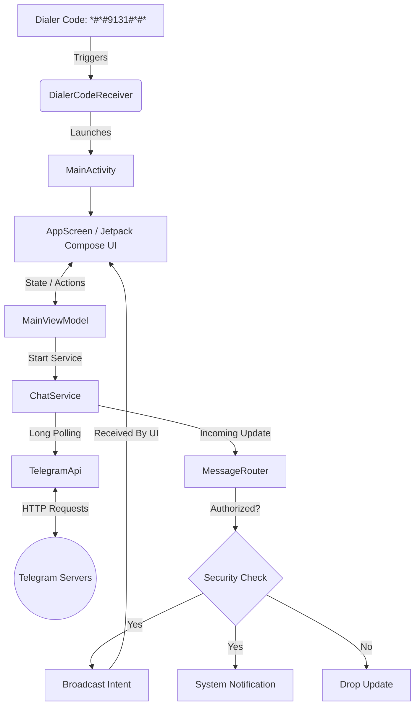

# Superior Chat Architecture

Superior Chat is a lightweight, stealth-focused Android application designed to facilitate secure communication over the Telegram Bot API while remaining completely hidden from the standard Android App Drawer.

## High-Level Architecture Overview

The application is structured into the following core layers:

### 1. Stealth & Entry Point (Camouflage Layer)
- **App Drawer Hiding**: The application intentionally disables its main launcher activity (`MainActivityLauncher`) when activated, causing the icon to vanish from the user's home screen and app drawer.
- **Dialer Code Receiver**: To access the application, a `BroadcastReceiver` (`DialerCodeReceiver`) listens for a specific secret dialer code (`*#*#9131#*#*`). Upon entering this code in the phone's dialer, the receiver intercepts the broadcast and launches the `MainActivity`.

### 2. UI Layer (Jetpack Compose)
Built entirely using modern declarative UI (Jetpack Compose) and Material Design 3.
- **`AppScreen` & Navigation**: Manages the main navigation drawer and hosts three primary destinations:
  - **`ChatScreen`**: The primary user interface for reading and sending messages.
  - **`SettingsScreen`**: Configuration for Telegram credentials (Bot Token, Chat ID, Owner ID).
  - **`PermissionsScreen`**: A streamlined page to ensure the app has the necessary OS permissions (Notifications, Battery Optimization).
- **`MainViewModel`**: Acts as the state holder. It manages UI state, retrieves settings via `PrefsManager`, and handles the logic for starting/stopping the background service.

### 3. Background Service Layer
- **`ChatService`**: A sticky Android Foreground Service designed to run continuously in the background. It uses Kotlin Coroutines to maintain a long-polling loop against the Telegram API.
- **Network Resilience**: The service monitors Android's `ConnectivityManager`. When the network drops, polling pauses; when the network returns, polling automatically resumes.

### 4. Network & API Layer
- **`TelegramApi`**: A centralized singleton utilizing `OkHttp` to communicate with Telegram's servers. It handles endpoints such as `getUpdates`, `getMe`, and `sendMessage`.
- **Serialization**: JSON parsing is handled by `kotlinx.serialization`, strictly mapping Telegram's JSON responses to typed Kotlin data classes (`UpdateResponse`, `GetMeResponse`, etc.).

### 5. Message Routing & Communication
- **`MessageRouter`**: When `ChatService` receives a valid update from Telegram, it passes the payload to the `MessageRouter`.
- **Security Check**: The router strictly validates that the incoming message originates from the authorized `chat_id` or `owner_id` configured in the settings. Unauthorized messages are silently dropped.
- **UI & System Updates**: 
  - Valid messages trigger a local `Intent` broadcast (`com.mobile.superiorutils.INCOMING_MESSAGE`). If the UI is open, it intercepts this broadcast and displays the message in the `ChatScreen`.
  - The router also interacts with the `NotificationManager` to fire a high-priority system notification, ensuring the user is alerted to new messages even if the app is closed.

## Component Interaction Flow

## Security & Persistence
- **No Root Required**: The application operates entirely within standard Android user space constraints without requiring Magisk or root-level capabilities.
- **Battery Optimization Exemption**: To ensure `ChatService` is not killed by Android's Doze mode during deep sleep, the app explicitly guides the user to grant the `REQUEST_IGNORE_BATTERY_OPTIMIZATIONS` permission.
