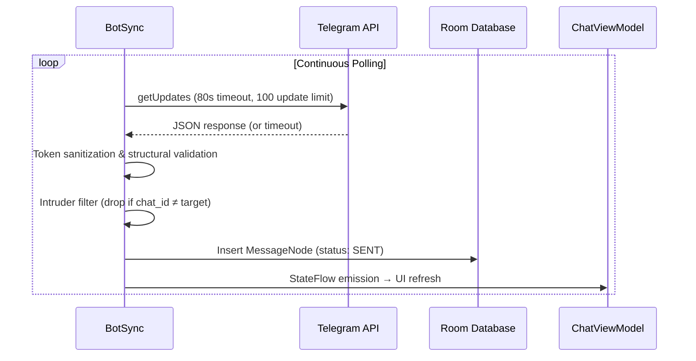
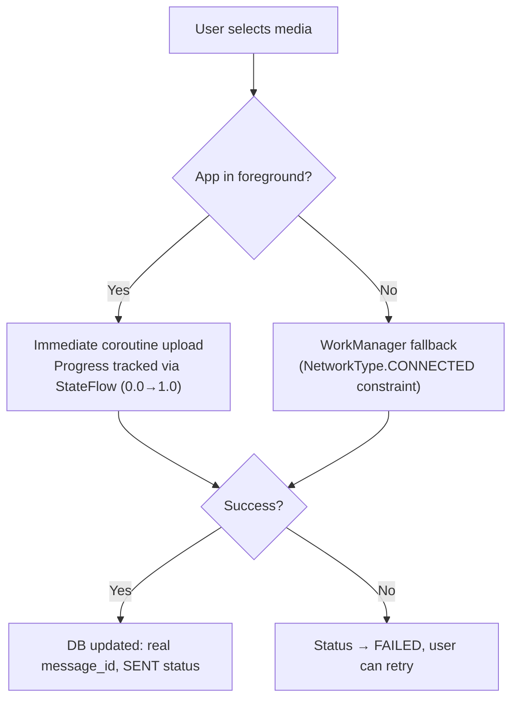
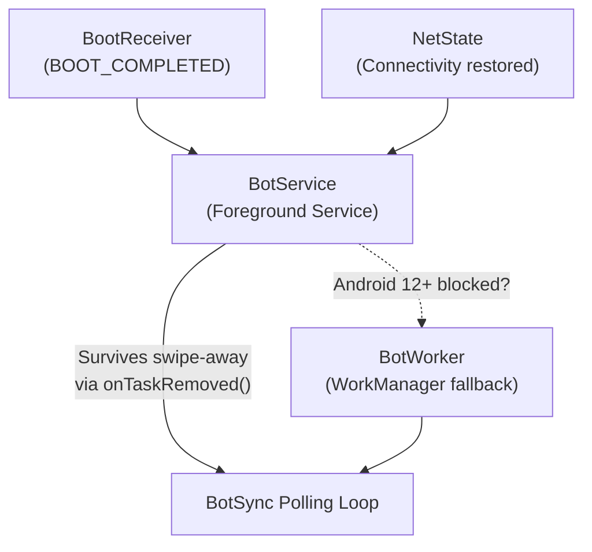

<h1 align="center">
  Backend Mechanics
</h1>

<p align="center">
  <strong>Polling Engine, Data Pipeline & Transfer Systems</strong>
</p>

---

> [!NOTE]
> This document covers the backend subsystems powering Superior Chat — the polling engine, message lifecycle, media transfers, background execution, and storage architecture. For module layout and directory structure, see [Architecture.md](Architecture.md).

---

## Table of Contents
- [1. Polling Engine (BotSync)](#polling)
- [2. Message Lifecycle](#lifecycle)
- [3. Media Transfer System (MediaSync)](#media)
- [4. Background Execution](#background)
- [5. Data Storage](#storage)
- [6. Weather API Integration (weather Flavor)](#weather-api)
- [7. Error Handling & Recovery](#error)

---

<h2 id="polling">1. Polling Engine (BotSync)</h2>

The core networking loop lives in `BotSync.kt`. It long-polls Telegram's `getUpdates` endpoint and processes incoming messages in real-time.

### Polling Lifecycle



### Network Awareness
- **Online detection**: `ConnectivityManager.NetworkCallback` requiring both `NET_CAPABILITY_INTERNET` and `NET_CAPABILITY_VALIDATED`
- **Offline behavior**: Polling suspends immediately on network loss, resumes instantly on reconnection via `NetworkWakeChannel`
- **Backoff strategy**: Exponential — 333ms base, doubles per failure, capped at 5 minutes
- **API reachability**: Tracked separately from general connectivity via reactive state flows (`AppLog.isTelegramApiReachable`), allowing the system to instantly distinguish between being offline versus having invalid Telegram API access.

### Rate Limiting
Token bucket algorithm in `SendRateLimiter`: 3 tokens, refills at 3/sec. Burst capacity of 3 messages, then ~333ms spacing.

---

<h2 id="lifecycle">2. Message Lifecycle</h2>

### Outbound (Sending)

| Step | Action | Status |
|------|--------|--------|
| 1 | User submits text/media via `ChatInputBox` | — |
| 2 | `ChatViewModel` inserts to Room DB with temp ID | `QUEUED` |
| 3 | If online → `BotSync.flushQueuedMessages()` | `SENDING` |
| 4a | Success → DB updated with real Telegram message ID | `SENT` |
| 4b | Failure → remains in queue for retry on reconnection | `FAILED` |

### Inbound (Receiving)

| Step | Action |
|------|--------|
| 1 | `BotSync.getUpdatesRaw()` receives update |
| 2 | Intruder filter validates `chat_id` matches stored target |
| 3 | `MessageNode` created → persisted via `AppRepository` |
| 4 | Media download enqueued if auto-download enabled |
| 5 | Camouflaged notification dispatched |
| 6 | `ChatViewModel` collects StateFlow → UI updates |

---

<h2 id="media">3. Media Transfer System (MediaSync)</h2>

All uploads and downloads are managed by `MediaSync.kt` with concurrent safety guarantees.



### Safety Guarantees
- **Mutex protection**: Prevents concurrent transfers of the same file
- **Cancellation support**: Proper cleanup via coroutine Job cancellation (integrated with `StatusFlow` for manual user cancellation)
- **State tracking**: Real-time progress computation and active transfer registry via global `StatusFlow`
- **Duplicate prevention**: WorkManager deduplication by tag (`msg_${messageId}`)
- **Size limits**: 20MB download cap (auto-rejects with sender notification), 50MB upload cap (Telegram API limit)
- **Transfer buffer**: 8KB streaming — files never fully loaded into memory
- **Processing efficiency**: Heavy mathematical scaling, rotation, and compression (e.g., via `FileUtils.cropAndScaleImage()`) are processed asynchronously via `Dispatchers.IO`, utilizing `BitmapRegionDecoder` to strictly limit memory footprint and prevent OOM errors.

### Storage Organization
```
/Android/media/<package>/<AppName>/Media/
├── Images/       (Sent/ + Received/)
├── Video/        (Sent/ + Received/)
├── Audio/        (Sent/ + Received/)
├── Documents/    (Sent/ + Received/)
└── VoiceNotes/   (Sent/ + Received/)
```
> `.nomedia` files auto-created in all Sent directories, VoiceNotes, and Documents to prevent gallery indexing.

---

<h2 id="background">4. Background Execution</h2>

### Service Resilience Hierarchy



| Layer | Mechanism | Trigger |
|-------|-----------|---------|
| **Primary** | `BotService` — Foreground Service (`FOREGROUND_SERVICE_TYPE_REMOTE_MESSAGING`) | App launch, boot, network restore |
| **Fallback** | `BotWorker` — WorkManager with `NetworkType.CONNECTED` constraint | Android 12+ foreground start blocked |
| **Recovery** | `ServiceCore.ensureRunning()` | Task removal, service crash |
| **Boot** | `BootReceiver` | `ACTION_BOOT_COMPLETED` |

---

<h2 id="storage">5. Data Storage</h2>

### Credential Security
`Prefs.kt` uses `EncryptedSharedPreferences` (AES-256-GCM) backed by Android Keystore master key. Stores: `bot_token`, `chat_id`, `last_update_id`, and user preferences. Falls back to software keystore if hardware unavailable.

### Room Database (LocalDb)

| Entity | Purpose | Key Fields |
|--------|---------|------------|
| `MessageNode` | Individual messages | messageId, text, status, mediaType, replyToMessageId |
| `ChatNode` | Conversation metadata | chatId, title, unreadCount, pinnedMessageId |
| `UserProfile` | Instant local caching of target info | title, username, bio, profilePhotoPath |
| `EmojiUsage` | Reaction frequency | emoji, count |

**Integrity**: Foreign keys with CASCADE delete (Message → Chat), indexed on `conversationId`, `status`, `timestamp`. Migrations v1→v8 with fallback handling at v3→v4.

**Data Wiping**: Supports full recursive destruction via sequential database clearing (`MessageDao.clearAllMessages()`) and local media wiping (`LocalDirs.getBaseDir().deleteRecursively()`).

---

<h2 id="weather-api">6. Weather API Integration (weather Flavor)</h2>

The backend architecture, offline caching system, and Retrofit network layer for the weather flavor are fully documented in [FlavorWeather.md](flavors/FlavorWeather.md).

---

<h2 id="error">7. Error Handling & Recovery</h2>

| Error | Detection | Response |
|-------|-----------|----------|
| **401 Unauthorized** | HTTP response from Telegram | Token marked invalid → `AUTH_ERROR` state → prompt re-setup |
| **409 Conflict** | Competing polling instance | Backoff doubled to yield to other instance |
| **Network loss** | `ConnectivityManager` callback | Polling pauses, messages queue as `QUEUED`, auto-flush on restore |
| **Media >20MB** | Size check before download | Rejected with automated notification to sender |
| **Service crash** | Watchdog timer | Restart via `ServiceCore.ensureRunning()` |
---

<p align="center">
  <sub>Built with ❤️ by <a href="https://gitlab.com/sandeshsahu">@sandeshsahu</a></sub>
</p>