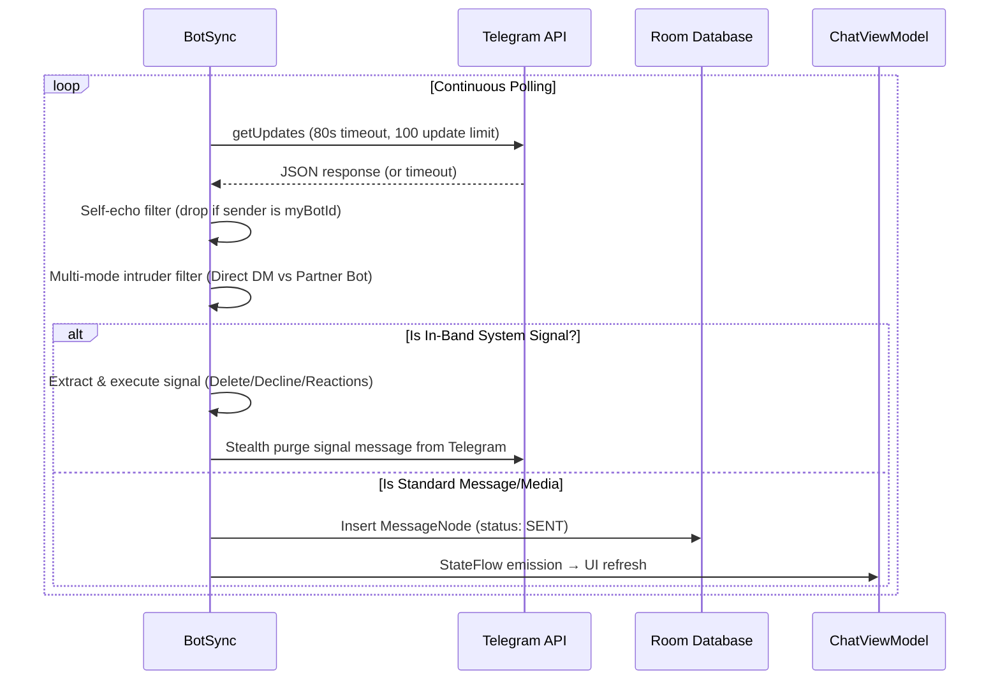
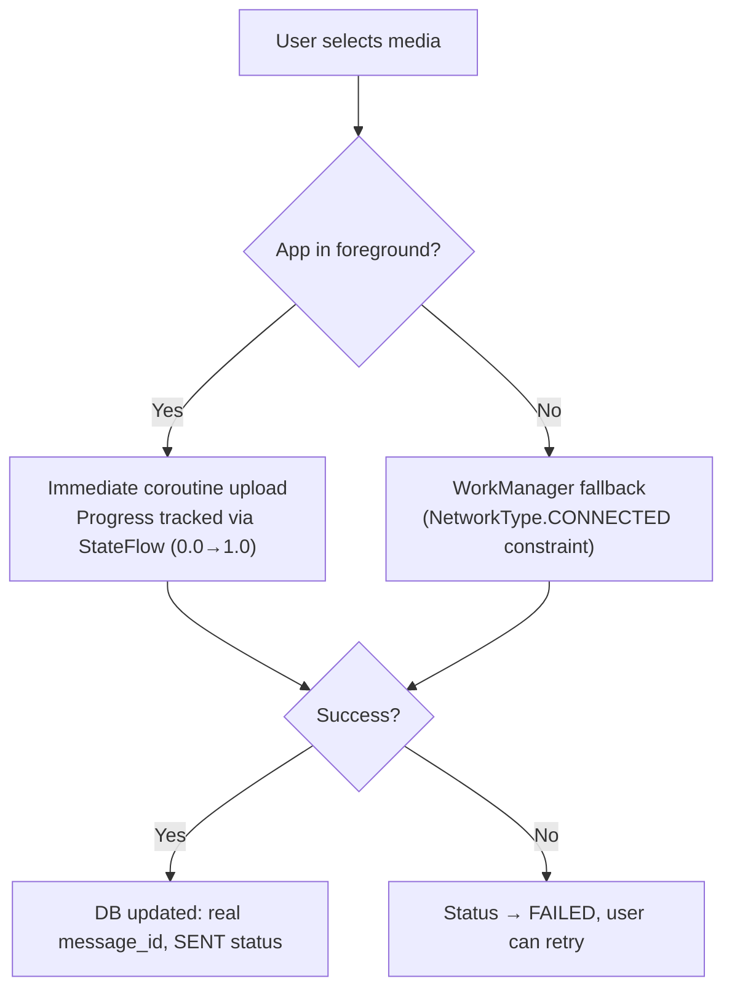
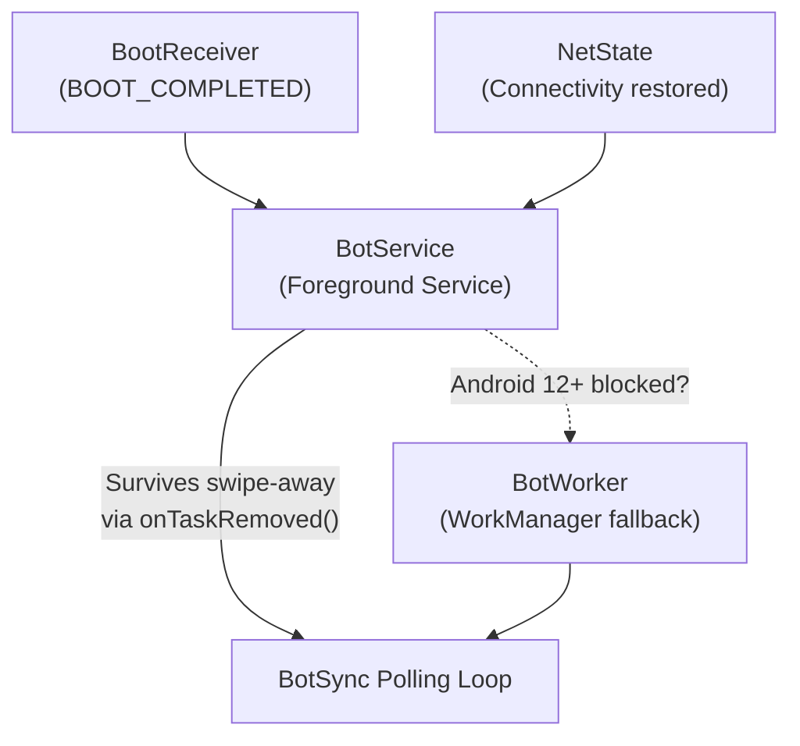
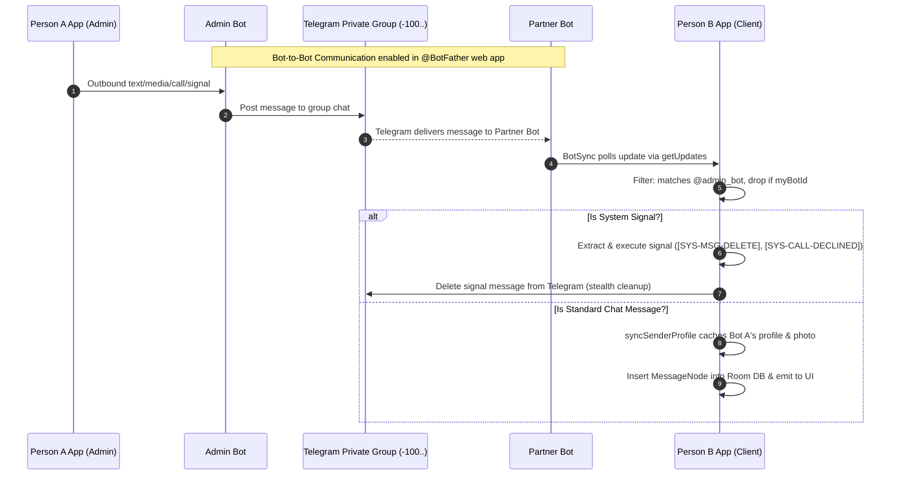

<h1 align="center">
  Backend Mechanics
</h1>

<p align="center">
  <strong>Polling Engine, Data Pipeline & Transfer Systems</strong>
</p>

---

> [!NOTE]
> This document covers the backend subsystems powering Superior Chat — the polling engine, message lifecycle, media transfers, background execution, and storage architecture. For module layout and directory structure, see [Architecture.md](Architecture.md).

---

## Table of Contents
- [1. Polling Engine (BotSync)](#polling)
- [2. Message Lifecycle](#lifecycle)
- [3. Media Transfer System (MediaSync)](#media)
- [4. Background Execution](#background)
- [5. Data Storage](#storage)
- [6. Call Mechanism (WebRTC)](#call-mechanism)
- [7. Weather API Integration (weather Flavor)](#weather-api)
- [8. Error Handling & Recovery](#error)
- [9. App-to-App Bot Bridge Backend](#app-to-app-backend)

---

<h2 id="polling">1. Polling Engine (BotSync)</h2>

The core networking loop lives in `BotSync.kt`. It long-polls Telegram's `getUpdates` endpoint and processes incoming messages in real-time.

### Polling Lifecycle



### Network Awareness
- **Online detection**: `ConnectivityManager.NetworkCallback` requiring both `NET_CAPABILITY_INTERNET` and `NET_CAPABILITY_VALIDATED`
- **Offline behavior**: Polling suspends immediately on network loss, resumes instantly on reconnection via `NetworkWakeChannel`
- **Instant polling interruption**: On credential or mode changes, `BotService` sends `ACTION_RESTART_POLLING`, causing `BotSync.restartPolling()` to abort hanging 80-second OkHttp connections (`dispatcher.cancelAll()`) and reset `lastUpdateId = 0L` to immediately process new updates.
- **Backoff strategy**: Exponential — 333ms base, doubles per failure, capped at 5 minutes
- **API reachability**: Tracked separately from general connectivity via reactive state flows (`AppLog.isTelegramApiReachable`), allowing the system to instantly distinguish between being offline versus having invalid Telegram API access.

### Rate Limiting & Live Ban Protection
The `SendRateLimiter` coordinator in `TelegramApi.kt` enforces multi-layer flood protection:
- **Group Flood Ban Safeguard**: Implements a sliding-window limiter of **19 messages per 60 seconds** in group chats to strictly prevent Telegram's automatic 24-hour account and bot flood bans.
- **Rapid-Fire Pacing (`LimitProtection`)**: Mandates a 500ms safety gap between consecutive HTTP requests.
- **HTTP 429 Interception (`RateLimited`)**: Dynamically parses Telegram's `retry_after` parameter, temporarily locking requests until the exact millisecond allowed.
- **Reactive State (`ThrottleState`)**: Emits `Idle`, `LimitProtection`, `RateLimited`, and `GroupLimit` to coordinate live input box countdown banners, reaction batches, message deletions, and call blocking diagnostics.

---

<h2 id="lifecycle">2. Message Lifecycle</h2>

### Outbound (Sending)

| Step | Action | Status |
|------|--------|--------|
| 1 | User submits text/media via `ChatInputBox` | — |
| 2 | `ChatViewModel` inserts to Room DB with temp ID | `QUEUED` |
| 3 | If online → `BotSync.flushQueuedMessages()` | `SENDING` |
| 4a | Success → DB updated with real Telegram message ID | `SENT` |
| 4b | Failure → remains in queue for retry on reconnection | `FAILED` |

### Inbound (Receiving)

| Step | Action |
|------|--------|
| 1 | `BotSync.getUpdatesRaw()` receives update |
| 2 | Self-echo check drops message if sender ID matches `prefs.myBotId` |
| 3 | Mode-aware intruder filter validates `chat_id` and `@partner_bot` username |
| 4 | `Validator.extractSystemSignal()` intercepts control signals (`[SYS-MSG-DELETE]`, `[SYS-CALL-DECLINED]`, `[SYS-REACTIONS]`) — executed out-of-band and purged from Telegram with zero DB or notification leaks |
| 5 | `syncSenderProfile` downloads/caches sender's avatar to isolated directory |
| 6 | `MessageNode` created → persisted via `AppRepository` |
| 7 | Media download enqueued if auto-download enabled |
| 8 | Camouflaged notification dispatched (suppressed if chat is active in foreground) |
| 9 | `ChatViewModel` collects StateFlow → UI updates |

---

<h2 id="media">3. Media Transfer System (MediaSync)</h2>

All uploads and downloads are managed by `MediaSync.kt` with concurrent safety guarantees.



### Safety Guarantees
- **Mutex protection**: Prevents concurrent transfers of the same file
- **Cancellation support**: Proper cleanup via coroutine Job cancellation (integrated with `StatusFlow` for manual user cancellation)
- **State tracking**: Real-time progress computation and active transfer registry via global `StatusFlow`
- **Duplicate prevention**: WorkManager deduplication by tag (`msg_${messageId}`)
- **Size limits**: 20MB download cap (auto-rejects with sender notification), 50MB upload cap (Telegram API limit)
- **Transfer buffer**: 8KB streaming — files never fully loaded into memory
- **Processing efficiency**: Heavy mathematical scaling, rotation, and compression (e.g., via `FileUtils.cropAndScaleImage()`) are processed asynchronously via `Dispatchers.IO`, utilizing `BitmapRegionDecoder` to strictly limit memory footprint and prevent OOM errors.

### Storage Organization
```
/Android/media/<package>/<AppName>/Media/
├── Images/       (Sent/ + Received/)
├── Video/        (Sent/ + Received/)
├── Audio/        (Sent/ + Received/)
├── Documents/    (Sent/ + Received/)
└── VoiceNotes/   (Sent/ + Received/)
```
> `.nomedia` files auto-created in all Sent directories, VoiceNotes, and Documents to prevent gallery indexing.

---

<h2 id="background">4. Background Execution</h2>

### Service Resilience Hierarchy



| Layer | Mechanism | Trigger |
|-------|-----------|---------|
| **Primary** | `BotService` — Foreground Service (`FOREGROUND_SERVICE_TYPE_REMOTE_MESSAGING`) | App launch, boot, network restore |
| **Fallback** | `BotWorker` — WorkManager with `NetworkType.CONNECTED` constraint | Android 12+ foreground start blocked |
| **Recovery** | `ServiceCore.ensureRunning()` | Task removal, service crash |
| **Boot** | `BootReceiver` | `ACTION_BOOT_COMPLETED` |

---

<h2 id="storage">5. Data Storage</h2>

### Credential Security
`Prefs.kt` uses `EncryptedSharedPreferences` (AES-256-GCM) backed by Android Keystore master key. Stores: `bot_token`, `chat_id`, `last_update_id`, `peerlink_group_chat_id`, `peerlink_partner_bot_username`, `is_peerlink_enabled`, `is_admin_mode_enabled`, `is_peerlink_hard_locked`, `is_background_calls_enabled`, `is_call_ringing_enabled`, and `is_exclude_from_recents_enabled`. Falls back to software keystore if hardware unavailable.

### Room Database (LocalDb)

| Entity | Purpose | Key Fields |
|--------|---------|------------|
| `MessageNode` | Individual messages | messageId, text, status, mediaType, replyToMessageId, editTimestamp, entities, replyToText |
| `ChatNode` | Conversation metadata | chatId, title, unreadCount, pinnedMessageId, draftText |
| `UserProfile` | Instant local caching of target info | title, username, bio, profilePhotoPath, isBot, userRole |
| `CallHistoryNode` | Call history and direction logs | callId, roomId, isIncoming, status, duration, timestamp, bytesTransferred |
| `EmojiUsage` | Reaction frequency | emoji, count |

**Integrity**: Foreign keys with CASCADE delete (Message → Chat), indexed on `conversationId`, `status`, `timestamp`. Migrations span from `v1` to `v14` (notably `MIGRATION_12_13` for call direction tracking and `MIGRATION_13_14` for comprehensive offline metadata).

**Data Wiping**: Supports full recursive destruction via sequential database clearing (`MessageDao.clearAllMessages()`) and local media wiping (`LocalDirs.getBaseDir().deleteRecursively()`).

---

<h2 id="call-mechanism">6. Call Mechanism (WebRTC)</h2>

The real-time audio and video call infrastructure is handled independently via WebRTC system. 

To maintain separation of concerns, the backend mechanics for signaling, ICE negotiation, and PeerJS connection handling are fully documented in the dedicated WebRTC backend documentation.

👉 **[View WebRTC Backend Mechanics](../webrtc/docs/Backend.md)**

---

<h2 id="weather-api">7. Weather API Integration (weather Flavor)</h2>

The backend architecture, offline caching system, and Retrofit network layer for the weather flavor are fully documented in [FlavorWeather.md](flavors/FlavorWeather.md).

---

<h2 id="error">8. Error Handling & Recovery</h2>

| Error | Detection | Response |
|-------|-----------|----------|
| **401 Unauthorized** | HTTP response from Telegram | Token marked invalid → `AUTH_ERROR` state → prompt re-setup |
| **409 Conflict** | Competing polling instance | Backoff doubled to yield to other instance |
| **Network loss** | `ConnectivityManager` callback | Polling pauses, messages queue as `QUEUED`, auto-flush on restore |
| **Media >20MB** | Size check before download | Rejected with automated notification to sender |
| **Service crash** | Watchdog timer | Restart via `ServiceCore.ensureRunning()` |

---

<h2 id="app-to-app-backend">9. App-to-App Bot Bridge Backend</h2>

The App-to-App Bot Bridge enables both users to chat and call directly inside the disguised Superior Chat application without touching the official Telegram client. It leverages Telegram's official **Bot-to-Bot Communication Mode** operating inside a private supergroup (`chat_id < 0`).

### Architecture Overview



### 1. Dual-Bot Group Transport Layer
- **Two Dedicated Bots**: One bot represents Person A (Admin), and the second represents Person B (Partner/Client).
- **Bot-to-Bot Communication Mode**: Configured via the BotFather web interface for both bots. This unlocks the ability for each bot to receive `Message` updates dispatched by the other bot within shared groups.
- **Group Privacy Mode Disabled**: Must be turned **OFF** in BotFather (`/setprivacy` $\rightarrow$ `Disable`) so the bots receive all group messages without requiring explicit `/command` mentions.
- **Group Administrator Privileges**: Both bots must be promoted to Administrators within the private group.
- **Self-Echo Drop (`myBotId`)**: `BotSync` checks `message.from.id == prefs.myBotId` and immediately drops self-generated messages to prevent message duplication and infinite reflection loops.

### 2. Multi-Mode Credential Routing & Intruder Filtering
The polling engine dynamically validates incoming updates across 3 operational modes:

| Mode | Identifier Target | Routing & Security Logic |
| :--- | :--- | :--- |
| **Direct 1-on-1 DM** | `chat_id > 0` (Numeric User ID) | `isPeerLinkEnabled = false`. Validates that `message.chat.id == activeChatId` (the user's private Telegram ID). Rejects messages from any other chat or user. |
| **Normal Telegram Group** | `chat_id < 0` (No partner bot handle) | `isPeerLinkEnabled = false`. Validates that `message.chat.id == activeChatId`. Accepts messages from all participants in that group (with dynamic per-sender profile resolution for each member), without enforcing bot-to-bot partner filtering. |
| **App-to-App Bot Bridge** | `chat_id < 0` (With partner bot handle) | `isPeerLinkEnabled = true`. Strictly enforces `isAuthorizedPeerLinkMessage()`: validates `message.chat.id == activeChatId` AND verifies that the sender is the designated `@peerLinkPartnerBotUsername`. Any messages from human members or foreign bots in the group are dropped as unauthorized intruders. |

### 3. In-Band System Signaling Subsystem (`SystemSignal`)
Internal control commands are transmitted across the bot bridge using structured system signals. `Validator.extractSystemSignal()` intercepts these at the core engine level before database insertion or notification dispatch:

- **Two-Way Batch Message Deletion (`[SYS-MSG-DELETE:<id1>,<id2>,...]`)**:
  - Transmits a comma-separated list of up to 100 Telegram message IDs.
  - The sender removes messages from the local Room DB only after Telegram confirms the HTTP deletion.
  - The receiver parses the signal, executes `deleteMessages(conversationId, messageIds)` in Room DB, and silently calls `TelegramApi.deleteMessage()` to purge the signal message from the Telegram group.
- **Bidirectional Call Decline (`[SYS-CALL-DECLINED]`)**:
  - Dispatched to the group when a recipient declines an incoming WebRTC call.
  - The caller's app intercepts the signal, transitions `CallState` from `RINGING` / `CONNECTING` to `IDLE`, stops local ringer audio, and cleans up the signal message from Telegram.
- **Batch Reaction Synchronization (`[SYS-REACTIONS: <id>=<emoji>;...]`)**:
  - Consolidates multi-message reactions into a single batch signal.
  - Buffered over a 5-second debounce window with a 2-second stagger and 300ms sequential pacing to comply with Telegram rate limits.
- **Zero-Leak Guarantee**: System signals are stripped before reaching `MessageBubble`, `ChatScreen`, SQLite Room database, or flavor notification engines.

### 4. Dynamic Per-Sender Profile Resolution
In group chats, the container group ID (`chat_id`) does not reflect the individual speaking. The backend decouples identity resolution:
- **Profile Observation**: `ProfileDao.getAllProfiles()` exposes a reactive `Flow<Map<String, UserProfile>>` keyed by `senderId`.
- **Isolated Avatar Caching**: `MediaSync.syncSenderProfile()` downloads avatars via `getUserProfilePhotos` / `getChat` and saves them to isolated disk paths (`profiles/profile_${senderId}_${photoUniqueId}.jpg`), preventing cross-sender cache collisions.
- **Adaptive Display**: Bubbles and dialogs query `userProfiles[msg.senderId]` to render the actual partner bot's name, username, and avatar rather than the group's metadata.

### 5. WebRTC Group Call Coordination
- **Bidirectional Call Signaling**: Either bot can post an encrypted call invitation link to the group.
- **Direction-Aware Tracking**: Incoming invites extract `roomId` and `secret` directly from the URL hash parameters, logging calls as `isIncoming = true` in `CallHistoryNode` and routing to active ringers or subtle pocket haptics.
- **Call State Synchronization**: Upon peer connection, `CallViewModel.monitorCallLifecycle()` edits the group call message to `"Call in Progress"` and removes inline keyboard buttons, preventing duplicate connection attempts during active calls.

---

<div align="center">
  <sub>Built with ❤️ by <a href="https://gitlab.com/sandeshsahu">@sandeshsahu</a></sub>
</div>
