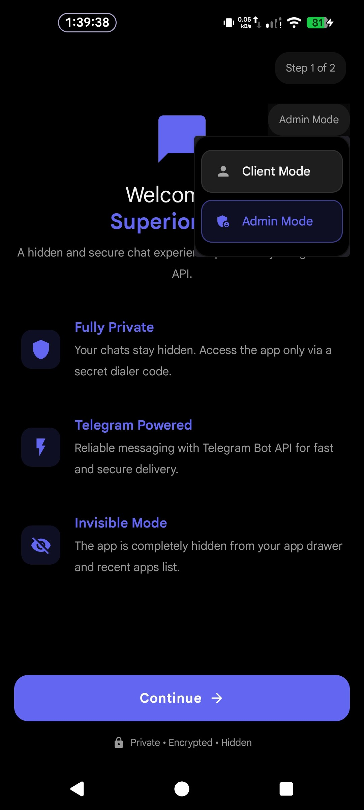
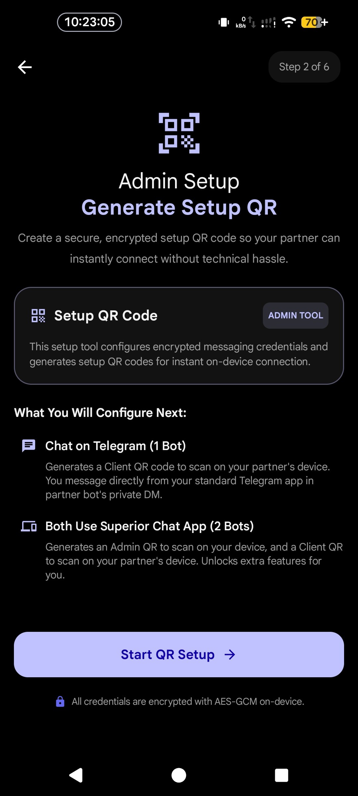
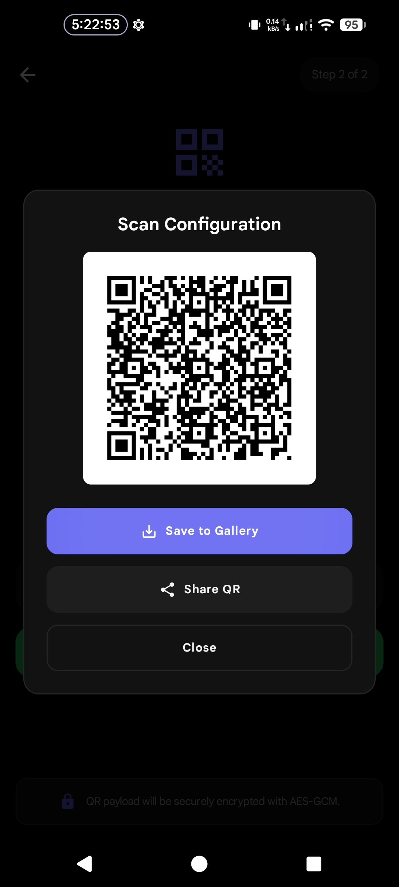
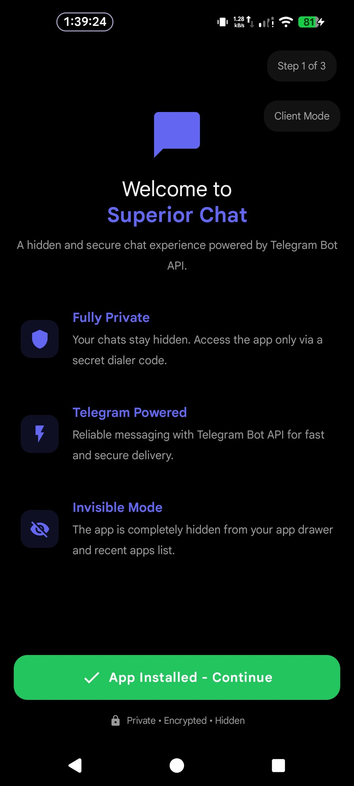
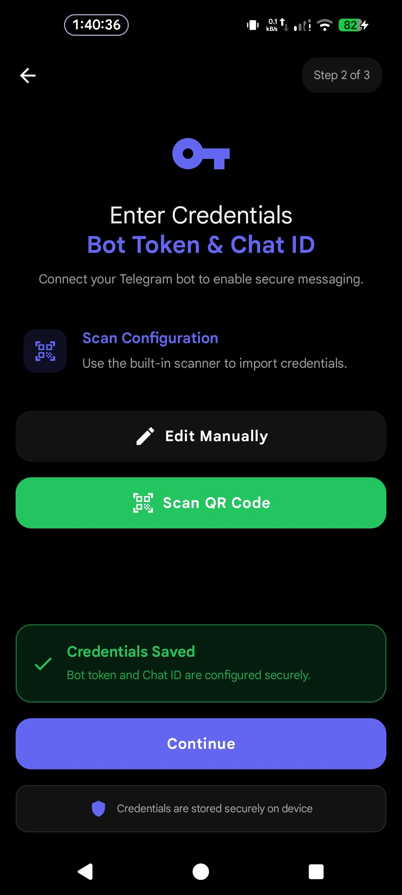
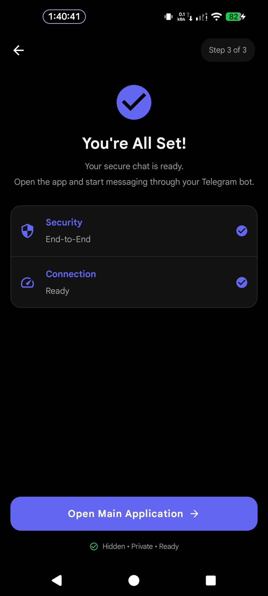

<h1 align="center">
  Installation & Setup Guide
</h1>

  <strong>Complete Step-by-Step Instructions for Superior Chat</strong>

---

> [!NOTE]
> Superior Chat is a two-way system. **Person A** uses the official Telegram app, while **Person B** uses the custom Superior Chat app (or vice-versa). They communicate through a shared Telegram Bot.

---

## Table of Contents
- [Download: Pre-built APKs](#download)
- [Phase 1: Telegram Side (Person A)](#phase-1)
- [Phase 2: App Side (Person B)](#phase-2)
- [Phase 3: Building From Source (Developers)](#phase-3)

---

<h2 id="download">📥 Download Pre-built APKs</h2>

Before you begin, you must download the necessary APK files from our official GitLab repository.

> [!IMPORTANT]
> Currently only 1 camoflouged flavor of the app is available for download, which is **Captive Portal** flavor.

**Naming of flavors**:
- **Flavor** = Available Camoflouged Flavor (e.g. `CaptivePortal`)
- `[Flavor]SetupApp_Release.apk` - flavor of the setup app
- `[Original]App_Release.apk` - non-hidden, standard version of the app

👉 **[Download Latest APKs from GitLab Releases](https://gitlab.com/sandeshsahu/superiorchat/-/releases)**

**What to download:**
- `[Flavor]SetupApp_Release.apk` (Needed by Person A to generate the QR code, and Person B to install the Camouflage app).
- `[Original]App_Release.apk` (Only needed if Person B wants the non-hidden, standard version).

---

<h2 id="phase-1">🤖 Phase 1: Telegram Side (Person A)</h2>

Person A (the person using the official Telegram app) needs to create the communication bridge (the Bot) and generate a secure QR code for Person B.

### Step 1: Create the Telegram Bot
1. Open your Telegram app and search for **[@BotFather](https://t.me/BotFather)**.
2. Send the command `/newbot` to create a new bot.
3. Follow the prompts to choose a name and username for your bot.
4. Once created, BotFather will give you an **API Token** (e.g., `123456789:ABCdefGhIJKlmNoPQRsTUvwxyz`). Keep this safe!
5. Start a chat with your new bot.
6. Note down your personal **User ID** (You can easily get this by forwarding a message to `@userinfobot` or `@MissRose_bot`).

### Step 2: Generate the Setup QR Code
Person A uses the Superior Setup App to safely pack these credentials into an encrypted QR code.
1. Download and open the **Setup App** on your device.
2. Tap the **Admin Mode** toggle located at the top right (below the step indicator).
3. Proceed to **Step 2** and enter the Bot Token and User ID you got from Telegram.
4. Save the generated encrypted QR code or scan it directly on Person B's phone.

 

  
  &nbsp;
  
  &nbsp;
  

---

<h2 id="phase-2">📱 Phase 2: App Side (Person B)</h2>

Person B will install the actual Superior Chat application. There are two different "Flavors" of the app you can choose from depending on your need for stealth.

### Option A: Camouflage Flavor (Maximum Stealth)
This version hides itself entirely and requires the Setup App to install and configure.

1. **Install Setup App**: Download and install the `Setup App` APK.
2. **Client Mode**: Open it and ensure it is in **Client Mode** (default).
3. **Install Main App**: When prompted during Step 1, click to install the "Fake-Launcher" (Camouflage) chat application.
4. **Scan Credentials**: Continue to Step 2. Scan the encrypted QR code provided by Person A (or manually type the credentials).
5. **Wake Up & Bind**: Continue to Step 3. Tap the button to open the Main app from within the Setup App. This locks in your credentials.
6. **Cover Your Tracks**: The main app will now ask you to uninstall the Setup App. Choose **Uninstall** to remove all traces of configuration.
7. **Start Chatting**: Use your secret dialer code (`*#*#9131#*#*`) or Quick Settings tile to access the app going forward!

 

  
  &nbsp;
  
  &nbsp;
  

### Option B: Original Flavor (Non-Camouflage)
This version has a standard app icon and is simpler to set up (recommended for testing).

1. **Install Main App**: Download the latest "Original" release APK and install it.
2. **Open Settings**: Launch the app from your app drawer and go directly to App Settings.
3. **Enter Credentials**: Fill in your Bot Token and Chat ID or Scan the QR Code.
4. **Start Chatting**: You are ready to go!

---

<h2 id="phase-3">🛠️ Phase 3: Building From Source (Developers)</h2>

If you prefer to compile the application yourself instead of downloading the pre-built APKs, you can use the following Gradle commands in Android Studio or your terminal.

### Compiling the Apps

| App Flavor | Gradle Command | Description |
|------------|----------------|-------------|
| **Original** | `./gradlew app:assembleOriginalDebug` | Builds the standard visible chat app. |
| **Captive Portal** | `./gradlew app:assembleCaptivePortalDebug` | Builds the camouflaged, invisible chat app. |
| **Setup App** | `./gradlew setupapp:assembleCaptivePortalDebug` | Builds the Setup wizard application with `CaptivePortal Flavor`. |

> [!WARNING]
> **Important Note for Setup App Compilation:**
> When building the Setup App for the Captive Portal flavor, you **must** first build the `app:assembleCaptivePortalDebug` APK. Once built, copy that resulting APK file into the `setupapp\src\main\assets` folder *before* running the `setupapp` build command. This bundles the hidden app inside the Setup wizard!
---

  Built with ❤️ by <a href="https://gitlab.com/sandeshsahu">@sandeshsahu</a>

