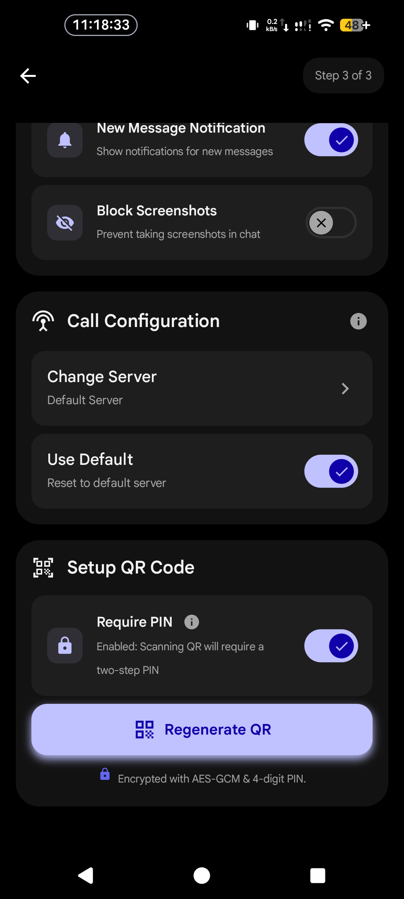
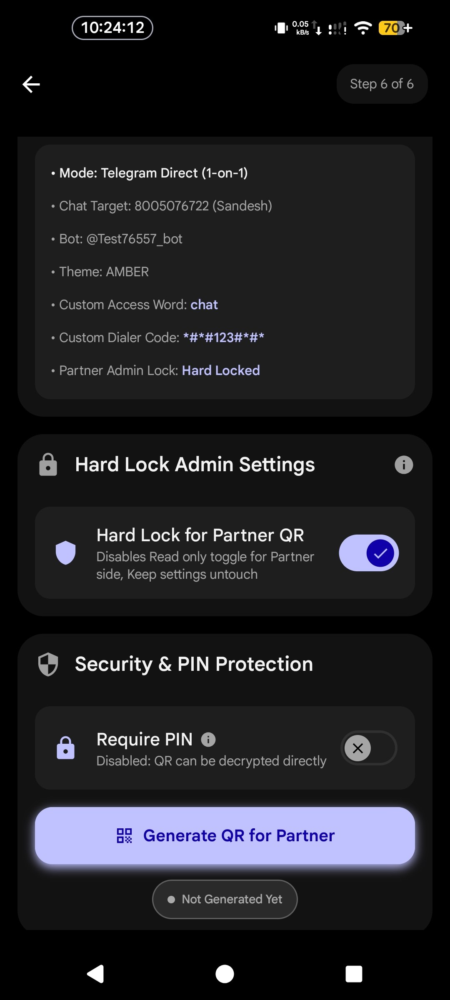

<h1 align="center">
  Setup Guide
</h1>

  <strong>Complete Step-by-Step Connection Instructions for Superior Chat</strong>

---

| Mode | Who Uses What? | Key Benefit | Difficulty |
| :--- | :--- | :--- | :---: |
| **[Option 1: App to Telegram](#option-1)** | **Person A**: Official Telegram **Person B**: Disguised Chat App | Easiest setup • No group needed | ⭐ *Beginner* |
| **[Option 2: App to App](#option-2)** | **Person A**: Disguised Chat App **Person B**: Disguised Chat App | Both chat inside app • Mutual call popups | 🚀 *Advanced* |

> [!NOTE]
> If you have not installed the application on your phone yet, please read the **[Installation Guide](Installation.md)** first.

---

## Table of Contents
- [Option 1: App to Telegram (Easiest)](#option-1)
  - [Step 1: Create the Telegram Bot (Person A)](#step-1-create-the-telegram-bot)
  - [Step 2: Generate the Setup QR Code (Person A)](#step-2-generate-the-setup-qr-code)
  - [Step 3: Connect on Person B's Device](#step-3-connect-on-person-b-device)
- [Option 2: App to App (Both on Superior Chat)](#option-2)
  - [How App-to-App Mode Works](#how-app-to-app-works)
  - [Step 1: Create Bots & Configure Settings via @BotFather Web Page](#app-to-app-step-1)
  - [Step 2: Create Private Telegram Group & Promote Both Bots to Admin](#app-to-app-step-2)
  - [Step 3: Generate Dual QRs in Setup App (Person A / Admin)](#app-to-app-step-3)
  - [Step 4: Scan Admin QR on Person A's Device](#app-to-app-step-4)
  - [Step 5: Scan Client QR on Partner's Device (Person B)](#app-to-app-step-5)
- [Configuring Voice & Video Calls (Optional)](#calls-setup)

---

<h2 id="option-1">🟢 Option 1: App to Telegram (Easiest)</h2>

In this mode, **Person A** chats directly inside the official Telegram app, while **Person B** chats inside the disguised Superior Chat app. Person A acts as the Administrator and sets up the bridge.

<h3 id="step-1-create-the-telegram-bot">Step 1: Create the Telegram Bot (Person A)</h3>

1. Open your official Telegram app and search for **[@BotFather](https://t.me/BotFather)**.
2. Send the command `/newbot` to create a new bot.
3. Follow the prompts to choose a display name and a username ending in `bot` (e.g., `my_secret_chat_bot`).
4. Once created, BotFather will give you an **API Token** (e.g., `123456789:ABCdefGhIJKlmNoPQRsTUvwxyz`). Keep this safe!
5. Open a chat with your newly created bot on Telegram and press **Start** (or send `/start`).
6. Retrieve your personal **Telegram User ID** (forward any message to `@userinfobot` or `@MissRose_bot` to get your numeric ID).

<h3 id="step-2-generate-the-setup-qr-code">Step 2: Generate the Setup QR Code (Person A) for Person B</h3>

Person A uses the **Superior Setup App** to safely encrypt these credentials into a scannable QR code:

1. Download and open the **Setup App** on your device.
2. Tap the **Admin Mode** toggle located at the top right (below the step indicator).
3. Select **"I will chat on Telegram (Standard Mode)"** and continue to Step 2.
4. Enter the **Bot Token** and **Your** Telegram User ID** (Chat ID).
5. **Enable PIN Protection (Recommended)**: If PIN protection is enabled, the QR code is securely encrypted with a 4-digit PIN. Share this 4-digit PIN with Person B so they can import it.
6. Share the generated encrypted QR code to **Person B** to scan or display it on screen for Person B to scan.

> [!WARNING]
> **Direct Mode Vulnerability**: If you disable "Require PIN" to generate a Direct Mode QR (`DIR_QR`), the app falls back to a default key. Because this project is open-source, anyone who gets hold of an un-PINned QR code could decrypt it and gain access to your Telegram bot. Always use PIN protection! See the [Threat Model in Notes.md](Notes.md#threat-model) for details.

 

  
  &nbsp;
  
  &nbsp;
  

  <b>📂 <a href="images/setupapp/admin_mode/">View Admin Mode Screenshots Directory</a></b>

<h3 id="step-3-connect-on-person-b-device">Step 3: Connect on Person B's Device</h3>

Person B opens Superior Chat (or Setup App in Client Mode) and scans the generated **Client QR** code (**Three way to do**):
1. **Using Setup App (Captive Portal / Play Support)**: In Client Mode Step 2, tap **Scan QR Code**, scan the QR, enter the 4-digit PIN, and tap **Wake Up & Launch**.
2. **Using Weather or Original Flavor**: Simply open the app and tap the **Scanner button on top of the chat screen** to scan the QR code directly!
3. **Manual Entry**: In Settings → Credentials, Person B can also manually paste the Bot Token and Person A's Telegram User ID.

---

<h2 id="option-2">🚀 Option 2: App to App (Both on Superior Chat)</h2>

In this mode, **both Person A and Person B chat directly inside Superior Chat**. Neither user uses the official Telegram app for messaging.

> [!TIP]
> **How App-to-App Mode Works**
> 
> Instead of chatting directly with a bot in a 1-on-1 DM, two bots communicate inside a private Telegram group:
> - **Two Separate Bots**: One bot represents **Person A (Admin)**, and another bot represents **Person B (Partner)**.
> - **Bot-to-Bot Communication Mode**: Can be found in `@BotFather's` web page (guide videos can be found on our [Telegram group](https://t.me/SuperiorChatGithub)) so both bots can see and reply to each other's messages inside the group.
> - **Private Telegram Group**: Acts as the secure, private communication bridge connecting both bots.
> - **Setup App Dual QRs**: Automatically packs all credentials into two separate QR codes:
>   - 📱 **Client QR**: Applied on Person B's phone (enables *Route Messages*).
>   - 🛡️ **Admin QR**: Applied on Person A's phone (enables *I Am Admin*).

---

<h3 id="app-to-app-step-1">Step 1: Create Bots & Configure Settings via @BotFather Web Page</h3>

> [!IMPORTANT]
> Telegram's **Bot-to-Bot Communication Mode is NOT available through standard chat commands or bot buttons**. It is **only available inside BotFather's Web Page**! Everything—creating both bots and configuring their settings—can be done directly inside this web page.

1. Open **[@BotFather](https://t.me/BotFather)** in Telegram.
2. Tap the **Open** button on the bottom-left (located right where the text input box is) to launch the **BotFather Web Page**.
3. **Create Two Bots** inside the web page:
   - Create **Bot 1** (for your partner, e.g., `alice_chat_bot`) and save its API token.
   - Create **Bot 2** (for yourself, e.g., `bob_admin_bot`) and save its API token.
4. **Configure Bot Settings** inside the web page (repeat for both bots):
   - Select your bot → open **Bot Settings**:
     - **Bot-to-Bot Communication Mode**: **Enable** *(mandatory for bots to receive each other's messages in a group)*.
     - **Group Privacy**: **Turn OFF / Disable** *(mandatory for bots to read group messages)*.
     - **Allow Groups?**: Ensure it is **Turned ON**.

---

<h3 id="app-to-app-step-2">Step 2: Create Private Telegram Group & Promote Both Bots to Admin</h3>

1. In Telegram, create a new **Private Group** and enable **Visible History** (Chat history for new members: Visible).
2. Add **both bots** (`alice_chat_bot` and `bob_admin_bot`) to this group.
3. Open Group Settings → **Administrators** → Promote **BOTH bots to Administrator** (grant them full permissions: send messages, embed links, manage chat, etc.).
4. Retrieve your **Group Chat ID** (starts with `-100...`). You can easily find it by adding `@MissRose_bot` to the group and sending the command `/id`.

---

<h3 id="app-to-app-step-3">Step 3: Generate Dual QRs in Setup App (Person A / Admin)</h3>

Person A (Admin) uses the **Superior Setup App** to verify the entire configuration live and generate both QR codes:

- 🔘 **Step 1 (Admin Mode)**: Toggle **Admin Mode** at the top right of the Setup App.
- 🔘 **Step 2 (Setup Hub)**: Tap the **Setup QR Code** action card and continue.
- 🔘 **Step 3 (Choose Chat Mode)**: Select **"I will also chat on Superior Chat (App-to-App Mode)"** and continue.
- 🔘 **Step 4 (2-Bot Credentials & Live Verification)**:
  - Enter **Partner's Bot Token** (her bot token).
  - Enter **Your Bot Token** (your admin bot token).
  - Enter **Group Chat ID** (e.g., `-1001234567890`).
  - Tap **Verify**: The Setup App checks Telegram live to verify that:
    - Both tokens are active and usernames are extracted.
    - Both bots are inside the group.
    - **Both bots are Administrators**.
    - **Group Privacy is disabled** on both bots.
  - Once all checks pass with green checkmarks, tap **Continue**.
- 🔘 **Step 5 (Stealth & Disguise Customization)**:
  - Optionally configure stealth access parameters (e.g., custom Weather search word, secret dialer code `*#*#<code>#*#*`, and screen security).
- 🔘 **Step 6 (Security & Dual QR Generation)**:
  - Keep **Require PIN** enabled (recommended 4-digit PIN).
  - Optional: Enable **Hard Lock** if you want to permanently lock Admin Settings on partner's phone.
  - Tap **Generate QR Code**.
  - The app displays **Dual QR Codes** with a tab selector:
    - 📱 **Partner QR (Client QR)**: For Person B's phone.
    - 🛡️ **Your QR (Admin QR)**: For Person A's phone.
  - Save both QR codes to your gallery or keep them on screen.

> [!TIP]
> **📹 Step 3 Video Walkthrough**:
> Detailed setup guide videos can be found on our official Telegram group: **[@SuperiorChatGithub](https://t.me/SuperiorChatGithub)**.

---

<h3 id="app-to-app-step-4">Step 4: Scan Admin QR on Person A's Device</h3>

Once both QR codes are generated, Person A configures their own Superior Chat app using the **Admin QR**:

1. Open your **Superior Chat** app (any flavor: Weather, Captive Portal, Play Support, or Original).
2. Navigate to **Application page → App Settings → Admin Options**.
3. Toggle "Read Only" OFF if it is locked.
4. Ensure **Route Messages** is enabled.
5. Under **I will chat here (Admin Mode)**, tap **Credentials → Scan QR**.
6. Scan your **Admin QR** and enter your 4-digit PIN.
7. Your app is now fully configured as the Admin node!

> [!TIP]
> **📹 Step 4 Video Walkthrough**:
> Detailed setup guide videos can be found on our official Telegram group: **[@SuperiorChatGithub](https://t.me/SuperiorChatGithub)**.

---

<h3 id="app-to-app-step-5">Step 5: Scan Client QR on Partner's Device (Person B)</h3>

Person B only needs to scan the **Client QR** on her device:

- **If using Invisible Flavors (Captive Portal / Play Support)**:
  1. Open the **Setup App** in Client Mode.
  2. Step 1: Tap to install the camouflage chat application.
  3. Step 2: Tap **Scan QR Code**, scan the **Client QR**, and enter the 4-digit PIN.
  4. Step 3: Tap **Wake Up & Launch** to bind credentials, then uninstall the Setup App.
- **If using Weather or Original Flavor**:
  1. Simply open the app (in Weather, type `superior chat` or your custom word in the search bar to enter).
  2. Tap the **Scanner button on top of the chat screen**!
  3. Scan the **Client QR**, enter the 4-digit PIN, and you are done!

> [!TIP]
> **📹 Step 5 Video Walkthroughs**:
> Detailed setup guide videos for both client scanning methods can be found on our official Telegram group: **[@SuperiorChatGithub](https://t.me/SuperiorChatGithub)**.

---

<h2 id="calls-setup">📞 Configuring Voice & Video Calls (Optional)</h2>

Superior Chat features a secure, peer-to-peer WebRTC calling engine. By default, it connects through public infrastructure, but you can configure it for maximum privacy.

1. **Test Default Calls**: Open a chat and press the **Call** button. If it connects successfully, you are ready to go!
2. **Configure Custom Server (Recommended)**: For true security and privacy, you should not rely on the default public servers.
   - Go to **Application page → App Settings → Call Configuration**.
   - Enter your self-hosted WebRTC domain (e.g., `https://call.yourdomain.com`).
   - Need help hosting? Read the **[WebRTC Deployment Guide](../webrtc/docs/Deployment.md)**.

---

### 💬 Need Help or Full Video Guides?
Stuck on any step, need troubleshooting assistance, or want to watch complete setup and demo videos?  
👉 **Check our Telegram Group: [@SuperiorChatGithub](https://t.me/SuperiorChatGithub)**

---

  Built with ❤️ by <a href="https://gitlab.com/sandeshsahu">@sandeshsahu</a>

