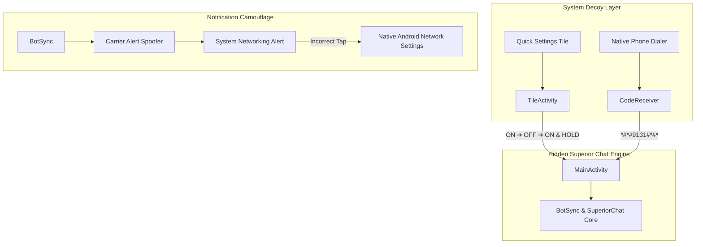

<h1 align="center">
  🔴 Captive Portal Flavor Documentation
</h1>

<p align="center">
  <strong>System Component Decoy & Advanced Camouflage</strong>
</p>

---

> [!NOTE]
> This document details the technical implementation, backend infrastructure, and usage mechanics for the `captivePortal` flavor (`com.android.connectivity.stats`). For the broader project architecture, refer to `Architecture.md`.

---

## Table of Contents
- [1. Architecture](#architecture)
- [2. Backend](#backend)
- [3. Features](#features)
- [4. Instructions](#instructions)
- [5. Notes](#notes)

---

<h2 id="architecture">1. Architecture</h2>

The Captive Portal flavor operates under the guise of an innate Android System component (specifically, "Carrier Services"). Unlike other flavors, it does not attempt to look like a normal user application. Instead, it completely hides itself from the user's app drawer and uses a standard system "Gear" icon to blend into the phone's native system settings list.



### Manifest Configuration
The main chat application's `MainActivity` does not have a `LAUNCHER` intent filter in this flavor, ensuring it never appears in the app drawer. It relies entirely on broadcast receivers (`CodeReceiver`) and specialized activities (`TileActivity`) to securely launch the main UI.

### Folder Structure
```text
app/src/captivePortal/
├── AndroidManifest.xml       # Removes Launcher Intent, adds TileService & Receiver
├── java/com/mobile/superiorchat/
│   └── bot/
│       └── Notifier.kt       # Generates fake Carrier Services notifications
└── res/
    ├── drawable/             # Camouflage icons (gear, tile)
    └── values/
        └── camo_strings.xml  # Fake system networking strings
```

---

<h2 id="backend">2. Backend</h2>

The backend for this flavor relies heavily on deep system integrations rather than external networking layers.

### Access Receivers
- **CodeReceiver**: Registers a `BroadcastReceiver` listening for the `android.provider.Telephony.SECRET_CODE` intent. When the specific sequence is dialed, it intercepts the broadcast and launches `MainActivity`.
- **TileActivity & Quick Settings Service**: Implements an `android.service.quicksettings.TileService` to place a seemingly benign network toggle in the user's quick settings dropdown. It tracks state changes (taps) and launches the main UI only when the precise sequence is executed.

### Notification Spoofing
The notification engine is deeply integrated with the device's telephony and network state managers. Instead of generic alerts, it spoofs carrier-level system warnings to notify the user of incoming messages without raising suspicion.

---

<h2 id="features">3. Features</h2>

- 📞 **Secret Dialer Access**: Open the application privately by dialing the secret code `*#*#9131#*#*` directly into your phone's native dialer.
- 🎛️ **Secret Access Via Tile**: Open the chat app via the disguised **Carrier Sync** Quick Settings Tile. 
  - **Access Sequence**: Tap the tile `ON`, then `OFF`, and finally `ON and HOLD` to enter the application. (This tile can be safely disabled from Application Settings, which includes a lockout warning prompt).
- 🔄 **Decoy Redirects**: If a snooper clicks the camouflaged notification or taps the Quick Settings tile without executing the correct sequence, they are instantly redirected to the native Android Network Settings.
- 🔔 **Carrier Notification Camouflage**: Incoming messages trigger harmless-looking system alerts based on data states:
  - **Idle**: `"[Carrier] - Standard rates apply"`
  - **New Message**: `"[Carrier] - High data usage detected"`
  - **Offline**: `"[Carrier] - Internet not connected"`
  - **API Issues**: `"[Carrier] - Check your data plan"`

*(The app auto-resets to the Idle state when opened to avoid suspicion).*

---

<h2 id="instructions">4. Instructions</h2>

### Build & Deployment
Use the following Gradle commands to compile the Captive Portal disguise:

```bash
# Compile and install Debug Main App APK
./gradlew app:assembleCaptivePortalDebug
./gradlew app:installCaptivePortalDebug

# Compile Setup App
./gradlew setupapp:assembleCaptivePortalDebug
```

> [!WARNING]
> **Setup App Bundling**
> When building the Setup App for this flavor, you **must** first build the `app:assembleCaptivePortalDebug` APK. Once built, copy that resulting APK file into the `setupapp\src\main\assets` folder *before* running the `setupapp` build command. This bundles the hidden app inside the Setup wizard!

---

<h2 id="notes">5. Notes</h2>

- **Dialer Code Incompatibility**: On heavily customized OEM ROMs (such as MIUI or ColorOS), the secret dialer code (`*#*#9131#*#*`) may fail to trigger due to aggressive system restrictions on secret code broadcasts. If this happens, use the Quick Settings Tile as your primary entry point.
- **System Gear Icon**: If someone inspects the "All Apps" list in their Android settings, they will see `Android System` with a gear icon. This is intentional and designed to look like a core OS component that shouldn't be uninstalled or tampered with.

---

<p align="center">
  <sub>Built with ❤️ by <a href="https://gitlab.com/sandeshsahu">@sandeshsahu</a></sub>
</p>
