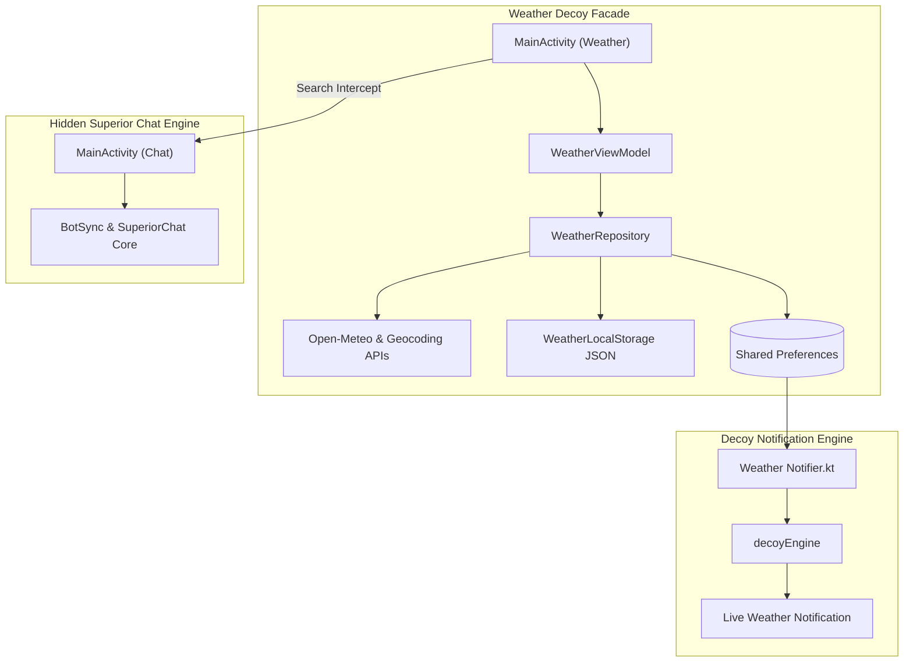
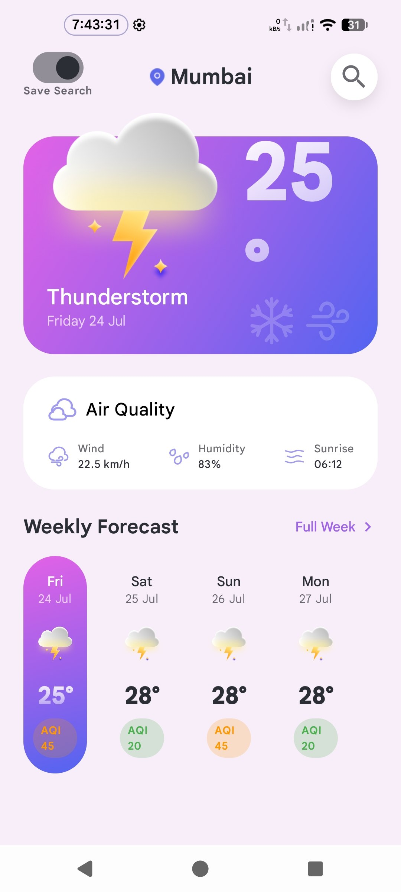
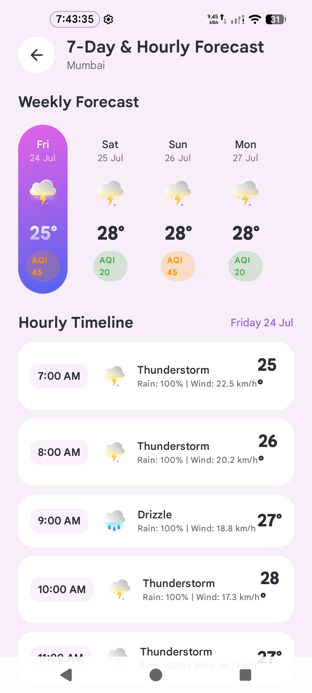
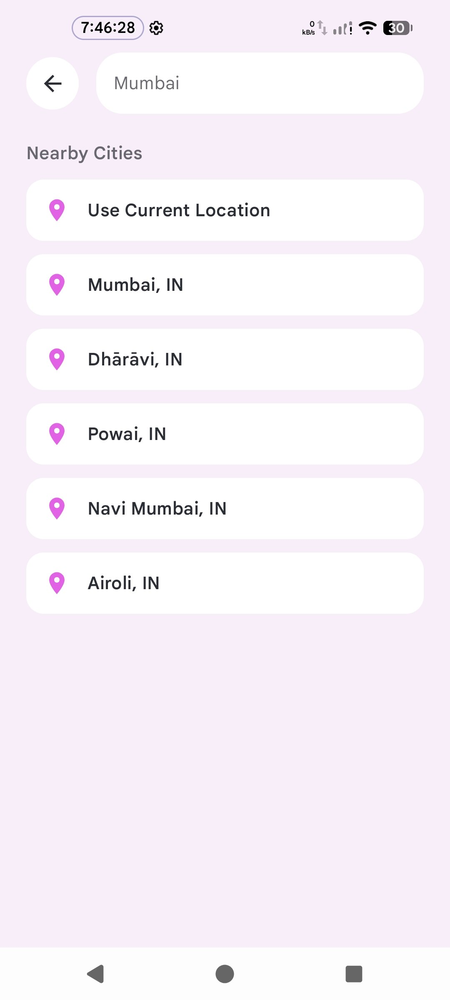

<h1 align="center">
  🌤️ Weather Flavor Documentation
</h1>

<p align="center">
  <strong>Decoy Application & Stealth Interception Mechanics</strong>
</p>

---

> [!NOTE]
> This document details the technical implementation, backend infrastructure, and usage mechanics for the `weather` flavor (`com.android.weather.info`). For the broader project architecture, refer to `Architecture.md`.

---

## Table of Contents
- [1. Architecture](#architecture)
- [2. Backend](#backend)
- [3. Features](#features)
- [4. Instructions](#instructions)
- [5. Notes](#notes)

---

<h2 id="architecture">1. Architecture</h2>

The Weather flavor unifies a standalone Compose UI facade, an isolated Retrofit network layer, an offline storage cache, and the shared `decoyEngine` system. It operates on a decoupled architecture where the UI and network layers function completely independently from the core `BotSync` engine.



### Manifest Configuration
The weather flavor sets the launcher activity in the Android OS drawer to the authentic Weather app icon and title (`MainActivity` under `com.android.weather.info`). The main chat application's `MainActivity` is isolated; it does not have a `LAUNCHER` intent filter in this flavor's manifest, ensuring it never appears in the app drawer.

### Folder Structure
```text
app/src/weather/
├── AndroidManifest.xml
├── java/com/android/weather/info/
│   ├── MainActivity.kt       # The facade Weather Activity
│   ├── data/                 # Networking, APIs, Repository
│   │   ├── WeatherModels.kt
│   │   ├── WeatherNetwork.kt
│   │   ├── WeatherRepository.kt
│   │   └── local/
│   │       ├── LocationPreference.kt
│   │       └── WeatherLocalStorage.kt
│   ├── ui/                   # Jetpack Compose UI (Screens, Components, Theme)
│   │   ├── WeatherViewModel.kt
│   │   ├── components/
│   │   │   ├── ActionBar.kt
│   │   │   ├── AirQuality.kt
│   │   │   ├── DailyForecast.kt
│   │   │   ├── ForecastShimmer.kt
│   │   │   ├── ShadowModifier.kt
│   │   │   ├── WeatherShimmer.kt
│   │   │   └── WeeklyForecast.kt
│   │   ├── screens/
│   │   │   ├── ForecastScreen.kt
│   │   │   ├── SearchScreen.kt
│   │   │   └── WeatherScreen.kt
│   │   └── theme/
│   │       ├── Color.kt
│   │       ├── Theme.kt
│   │       └── Type.kt
│   └── utils/                # Mapping logic and color utilities
│       ├── AirQualityData.kt
│       ├── ColorUtil.kt
│       ├── ForecastData.kt
│       ├── NavigationUtils.kt
│       └── WeatherUtils.kt
├── java/com/mobile/superiorchat/bot/
│   └── Notifier.kt           # Bridges live weather cache into fake notifications
└── res/                      # Weather specific assets, gradients, icons
    ├── drawable/
    ├── mipmap-*/             # Standard launcher icon assets 
    ├── values/
    │   ├── camo_strings.xml
    │   ├── colors.xml
    │   ├── strings.xml
    │   └── themes.xml
    └── xml/ 
```

---

<h2 id="backend">2. Backend</h2>

The decoy engine features a robust, multi-tier data fetching pipeline using `Retrofit` and `StateFlow`.

### Network Integrations
| Service | Endpoint Domain | Purpose | Security & Protocol |
| :--- | :--- | :--- | :--- |
| **Open-Meteo Forecast** | `api.open-meteo.com` | Hourly & 7-day temperature, condition, humidity forecasts | HTTPS |
| **Open-Meteo Geocoding** | `geocoding-api.open-meteo.com` | City search autocomplete & coordinates resolution | HTTPS |
| **Country Suggestions** | `countries.dev` | Default regional city suggestions when search is empty | HTTPS |
| **IP Location Fallback** | `ip-api.com` | Initial automatic location resolution without GPS permissions | HTTP (Cleartext) |

> [!WARNING]
> **Cleartext Traffic Policy**: `ip-api.com` operates over HTTP. To accommodate this fallback without compromising the entire app security, the weather flavor uses a dedicated `network_security_config.xml` that restricts HTTP traffic **exclusively** to `ip-api.com`.

### State Management & Caching
- **State Management**: `WeatherViewModel` drives the UI using a sealed `WeatherUiState` via `StateFlow`. Network requests run on `Dispatchers.IO` and search inputs are debounced (300ms) with `Job` cancellation to prevent API spam.
- **Offline Resilience**: `WeatherLocalStorage` saves the full JSON response of the last successful fetch. If the device goes offline, `WeatherRepository` silently falls back to the cached JSON payload.
- **Error State UI**: Even under total network failure without local data, the secret `ActionBar` entry point remains rendered, and the error screen utilizes `PullToRefreshBox` to allow manual API retries via swipe-down gestures.
- **Decoy Feed**: Upon successful fetches, the repository independently saves primitive strings (`temperature`, `condition`, `humidity`) directly to `SharedPreferences`. The decoupled `Notifier.kt` reads these cached values to generate live, context-aware meteorological alerts without needing to instantiate `WeatherViewModel`.

---

<h2 id="features">3. Features</h2>

- 🔍 **App Search Interception (The Secret Handshake)**: Type a secret access phrase into the decoy weather search bar and press Search to silently launch the chat engine. 
- 🔐 **Custom Access Word**: You can define your own Custom Access Word (e.g., `open door`) from within the **Application page $\rightarrow$ App Settings**. The default `superior chat` phrase will always remain active as a fallback lock-out prevention.
- 🔔 **Camouflage Notifications**: Incoming chat messages appear as harmless meteorological status updates.
  - *Idle*: `Currently In London` • `London, 22°C • Humidity 65%`
  - *Active Message*: `Live Update • London`
  - *Offline*: `Offline • Last Known data`
- 🌤️ **Authentic Weather Utility**: Includes fully functional 7-day forecasts, hourly breakdowns, and live city searches to maintain an impenetrable disguise.

<p align="center">
  
  &nbsp;&nbsp;
  
  &nbsp;&nbsp;
  
</p>

---

<h2 id="instructions">4. Instructions</h2>

### How to Set a Custom Access Word
1. Access the main chat app using the default `superior chat` search query.
2. Navigate to **Application page** $\rightarrow$ **App Settings** $\rightarrow$ **Set Custom Access Word**.
3. Type your desired custom phrase (must be at least 4 characters).
4. Click **Save Custom Word** and confirm the action in the warning dialog.
5. The field will clear and display a green **Saved!** animation upon success.

### Build & Deployment
Use the following Gradle commands to compile the standalone weather disguise:

```bash
# Compile and install Debug APK
./gradlew app:assembleWeatherDebug
./gradlew app:installWeatherDebug

# Compile Release APK
./gradlew app:assembleWeatherRelease
```

---

<h2 id="notes">5. Notes</h2>

- **Data Privacy**: The Weather flavor connects to public weather and geocoding services strictly to render the weather UI. **No chat payloads, bot tokens, or message metadata are transmitted to third-party APIs.**
- **Interception Logic**: The search bar intercept is hardcoded to handle the `onSearch` keyboard action. Users *must* press the enter/search key on their software keyboard to trigger the intercept; selecting autocomplete suggestions will behave like a normal weather search.
---

<p align="center">
  <sub>Built with ❤️ by <a href="https://gitlab.com/sandeshsahu">@sandeshsahu</a></sub>
</p>