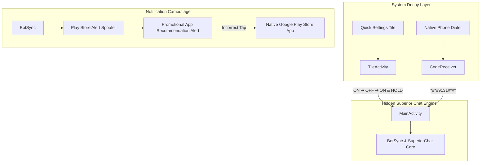

<h1 align="center">
  🎮 Play Support Flavor Documentation
</h1>

<p align="center">
  <strong>Google Play Store Decoy & Promotional Camouflage</strong>
</p>

---

> [!NOTE]
> This document details the technical implementation, backend infrastructure, and usage mechanics for the `playSupport` flavor (`com.android.vending.support`). For the broader project architecture, refer to `Architecture.md`.

---

## Table of Contents
- [1. Architecture](#architecture)
- [2. Backend](#backend)
- [3. Features](#features)
- [4. Instructions](#instructions)
- [5. Notes](#notes)

---

<h2 id="architecture">1. Architecture</h2>

The Play Support flavor operates under the guise of an innate Google Play Store component (specifically, "Google Play Support"). It completely hides itself from the user's app drawer and uses a standard Play Protect/Store icon to blend into the phone's native system processes and notifications.



### Manifest Configuration
The main chat application's `MainActivity` does not have a `LAUNCHER` intent filter in this flavor, ensuring it never appears in the app drawer. It relies entirely on broadcast receivers (`CodeReceiver`) and specialized activities (`TileActivity`) mapped from the shared `decoyEngine` to securely launch the main UI.

### Folder Structure
```text
app/src/playSupport/
├── java/com/mobile/superiorchat/
│   └── bot/
│       └── Notifier.kt       # Generates fake Google Play promotional notifications
└── res/
    ├── drawable/             # Camouflage icons (Play Protect logo, QS tile)
    └── values/
        └── camo_strings.xml  # Fake promotional app and game recommendation strings
```

---

<h2 id="backend">2. Backend</h2>

The backend for this flavor uses the `decoyEngine` infrastructure to intercept access routes and spoof normal smartphone background activity.

### Access Receivers
- **CodeReceiver**: Registers a `BroadcastReceiver` listening for the `android.provider.Telephony.SECRET_CODE` intent. When the specific sequence is dialed, it intercepts the broadcast and launches `MainActivity`.
- **TileActivity & Quick Settings Service**: Implements an `android.service.quicksettings.TileService` to place a seemingly benign feature toggle in the user's quick settings dropdown. It tracks state changes (taps) and launches the main UI only when the precise sequence is executed.

### Notification Spoofing
Instead of system warnings, the notification engine spoofs Google Play Store promotional notifications. It dynamically selects from a random array of convincing app recommendations and gaming ads to completely disguise message arrival.

---

<h2 id="features">3. Features</h2>

- 📞 **Secret Dialer Access**: Open the application privately by dialing the secret code `*#*#9131#*#*` (or your custom code) directly into your phone's native dialer.
- 🎛️ **Secret Access Via Tile**: Open the chat app via the disguised Quick Settings Tile (`Google Play Protect`). 
  - **Access Sequence**: Tap the tile `ON`, then `OFF`, and finally `ON and HOLD` to enter the application.
- 🔄 **Decoy Redirects**: If a snooper clicks the camouflaged notification or taps the Quick Settings tile without executing the correct sequence, they are instantly redirected to `https://play.google.com/store/apps` (the Google Play Store).
- 🔔 **Play Store Notification Camouflage**: Incoming messages trigger harmless-looking promotional alerts:
  - **Idle**: Randomly rotates standard promotions like *"Explore Play Points"* or *"Discover The Library"*.
  - **New Message**: `"[Recommended for you] - Check out the top trending apps of the week."`
  - **Offline**: `"[Editors' Choice] - Handpicked apps and games for you."`
  - **API Issues**: `"[Special Offer] - Unlock exclusive rewards in your favorite apps."`

*(The app auto-resets to a random Idle state when opened to avoid suspicion).*

---

<h2 id="instructions">4. Instructions</h2>

### Build & Deployment
Use the following Gradle commands to compile the Play Support disguise:

```bash
# Compile and install Debug Main App APK
./gradlew app:assemblePlaySupportDebug
./gradlew app:installPlaySupportDebug

# Compile Setup App
./gradlew setupapp:assemblePlaySupportDebug
```

> [!WARNING]
> **Setup App Bundling**
> When building the Setup App for this flavor, you **must** first build the `app:assemblePlaySupportDebug` APK. Once built, copy that resulting APK file into the `setupapp\src\main\assets` folder *before* running the `setupapp` build command. This bundles the hidden app inside the Setup wizard!

---

<h2 id="notes">5. Notes</h2>

- **Dialer Code Incompatibility**: On heavily customized OEM ROMs, the secret dialer code may fail to trigger due to aggressive system restrictions on secret code broadcasts. If this happens, use the Quick Settings Tile as your primary entry point.
- **Application Identity**: The application package name is `com.android.vending.support` which seamlessly matches the real Google Play Store (`com.android.vending`).

---

<p align="center">
  <sub>Built with ❤️ by <a href="https://gitlab.com/sandeshsahu">@sandeshsahu</a></sub>
</p>
