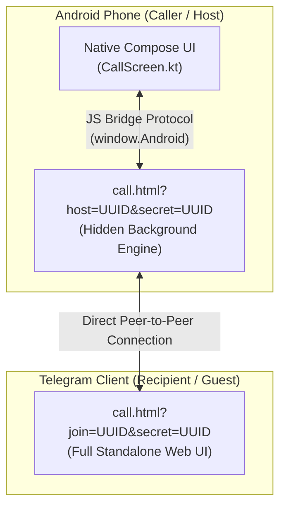

  
  
  
  <h1>Superiorchat Connect</h1>
  
<strong>The Headless WebRTC Calling Engine for SuperiorChat</strong>

  
  

    
    
    
  

---

> [!IMPORTANT]
> **Superiorchat Connect** is the standalone web engine that powers encrypted voice and video calls for SuperiorChat. It runs silently inside an Android WebView during calls for the caller, while providing a stunning, full-screen web UI for the Telegram recipient.

## ✨ Core Highlights

- 🔐 **Zero-Trust Security**: Built-in 128-bit cryptographic secret verification. No matching secret? No connection.
- ⚡ **True Peer-to-Peer**: Audio and video flow directly between devices. No middleman servers (except STUN/signaling).
- 👻 **Stealth Native Integration**: The Android host sees native Compose buttons, completely unaware of the DOM running underneath.
- 🚀 **Serverless Architecture**: 100% static files (`.html`, `.css`, `.js`). Deploy instantly to Vercel, Cloudflare Pages, or GitHub Pages.

---

## 📑 Table of Contents

- [1. How It Works](#how-it-works)
- [2. Visual Roles (Host vs. Guest)](#overview)
- [3. Android ↔ JavaScript Bridge Protocol](#bridge)
- [4. Deployment & Self-Hosting](#deployment)
- [5. Documentation Directory](#docs)

---

<h2 id="how-it-works">1. ⚙️ How It Works</h2>

---

<h2 id="overview">2. 🎭 Visual Roles (Host vs. Guest)</h2>

The web application is a chameleon. It adapts dynamically based on the URL parameters you feed it:

- 📱 **Host Mode (Android App)**: Loaded via `call.html?host=<UUID>&secret=<UUID>`. 
  - **Result**: The HTML UI elements are stripped away. The native Android Compose layout handles the UI, while the WebView silently processes audio/video and WebRTC signaling in the background.
- 💬 **Guest Mode (Telegram Browser)**: Loaded via `call.html?join=<UUID>&secret=<UUID>`. 
  - **Result**: Displays a beautiful, full-screen web calling interface (buttons, timers, avatars, PiP) for the Telegram recipient.

> 📐 **Design Rationale**: Curious why we used a web engine instead of native compiled WebRTC libraries? Read our ADR in [docs/Decisions.md](docs/Decisions.md#why-not-native).

---

<h2 id="bridge">3. 🌉 Android ↔ JavaScript Bridge Protocol</h2>

The WebView acts as an invisible sandbox. To allow the native Android app to control the call without accessing the DOM, we implemented a strict bi-directional bridge protocol.

- **Commands (App → Web)**: The native app uses `evaluateJavascript` to trigger functions like `androidToggleMute()` or `androidEndCall()`.
- **Events (Web → App)**: The web engine uses a globally injected `WebRTCInterface` (via `@JavascriptInterface`) to notify Android of state changes like `connected`, `hardware_ready`, or `ended`.

> 🏗️ **Full Protocol**: View the detailed event table, lifecycle sequence diagram, and **CSS Layout Coupling rules** in [docs/Architecture.md](docs/Architecture.md#bridge).

---

<h2 id="deployment">4. 🚀 Deployment & Self-Hosting</h2>

Superiorchat Connect is a completely static web application. It requires absolutely **no backend database** or Node.js server. 

> 🌐 **Self-Hosting Guide**: Follow our step-by-step instructions for deploying via GitHub/GitLab integration to Vercel, Cloudflare Pages, Netlify, or your own VPS in [docs/Deployment.md](docs/Deployment.md).

---

<h2 id="docs">5. 📚 Documentation Directory</h2>

Dive deep into the mechanics of the engine using our comprehensive documentation suite:

| Document | Purpose |
|---|---|
| 🏗️ **[Architecture.md](docs/Architecture.md)** | WebRTC engine structure, directory layout, JS bridge, and DOM layers |
| ⚡ **[Backend.md](docs/Backend.md)** | PeerJS signaling, ICE candidate exchange, and DataChannel protocol |
| 🛡️ **[Security.md](docs/Security.md)** | WebView sandbox limits, secret verification, and privacy threat models |
| 🚀 **[Deployment.md](docs/Deployment.md)** | How to deploy your own WebRTC engine on Vercel, Cloudflare Pages, or VPS |
| 🛠️ **[Troubleshoot.md](docs/Troubleshoot.md)** | Solutions for connection timeouts, permission denials, and server popups |
| 📐 **[Decisions.md](docs/Decisions.md)** | Architectural Decision Records (ADR) detailing design choices and stealth rules |
| 📝 **[Notes.md](docs/Notes.md)** | Essential developer notes, hardware gotchas, and stealth constraints |

---

   
  Built with ❤️ by <a href="https://gitlab.com/sandeshsahu">@sandeshsahu</a>

