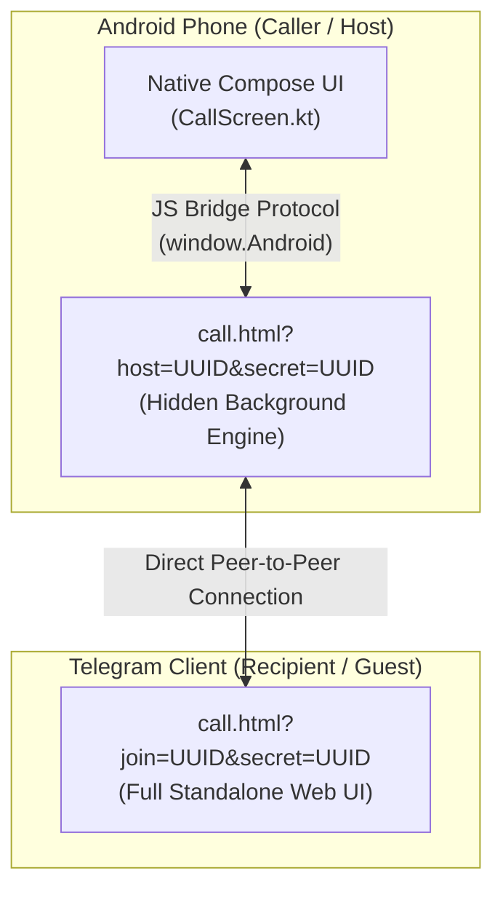
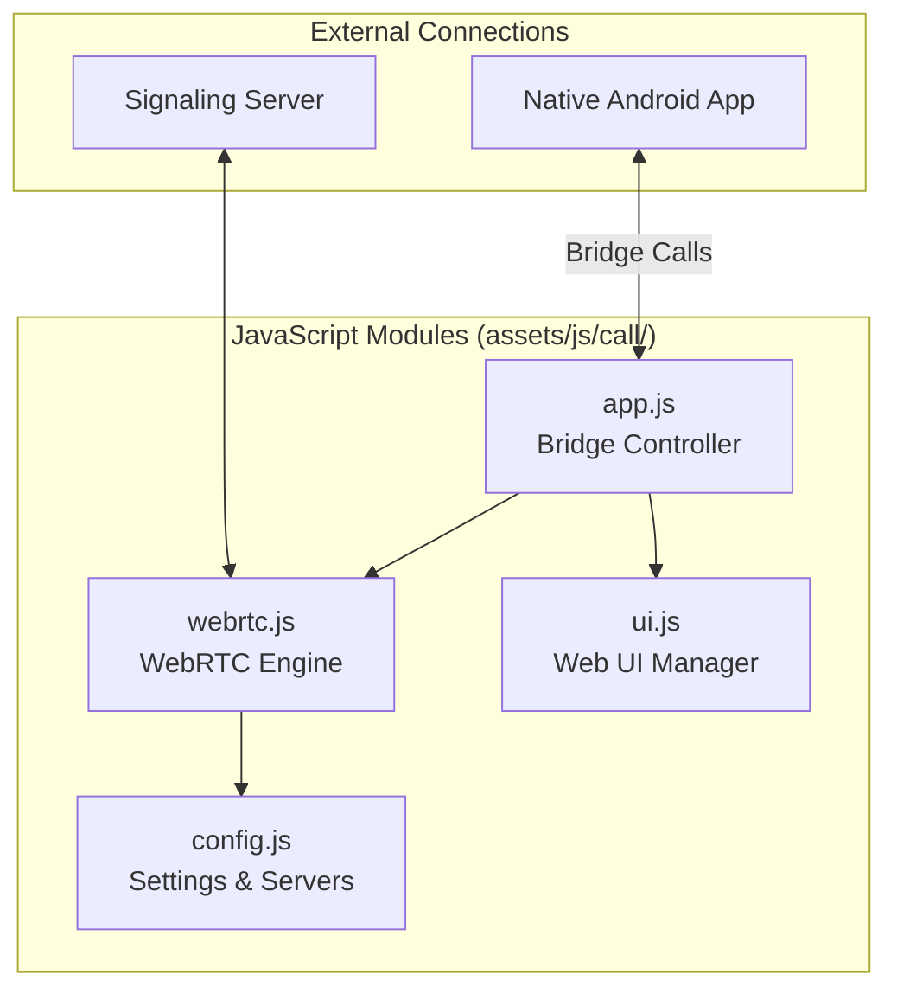
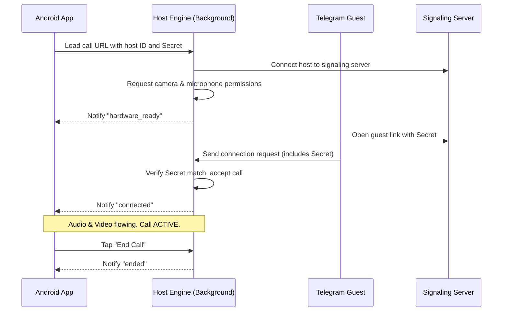

<div align="center">
  <h1>🏗️ WebRTC System Architecture</h1>
  <p><strong>Headless media engine, application topology, and component structure</strong></p>
</div>

---

> [!NOTE]
> **Superiorchat Connect** separates the calling logic from the Android application. The web engine handles WebRTC connection mechanics silently in the background, while the Android app displays a native Jetpack Compose user interface on top.

---

## 📑 Quick Navigation
- [1. How Dual-Mode Roles Work](#topology)
- [2. Component & Module Design](#modules)
- [3. Call Sequence & Security Handshake](#workflow)
- [4. Visual Layout & DOM Layers](#layout)
- [5. Android ↔ JavaScript Bridge](#bridge)
- [6. Real-Time DataChannel Sync](#datachannel)
- [7. Hardware & Lifecycle Sync](#hardware)
- [8. Strict Code Boundaries](#ownership)
- [9. Camera Layout Alignment](#css-coupling)
- [10. Related Documentation](#related-docs)

---

<h2 id="topology">1. How Dual-Mode Roles Work</h2>

The web application serves two roles depending on the URL parameters:



- 📱 **Host Mode (Android App)**: Loaded with `?host=UUID&secret=UUID`. The web UI buttons and headers are hidden (`display: none`). The native Android app draws all controls on screen, while the web engine runs silently in the background.
- 💬 **Guest Mode (Telegram Browser)**: Loaded with `?join=UUID&secret=UUID`. Displays a complete web interface with call controls, avatars, and timers for the Telegram recipient.

---

<h2 id="modules">2. Component & Module Design</h2>

The WebRTC engine files are structured as follows:

```text
superiorchat-connect/
├── index.html                    ← Public portfolio landing page
├── call.html                     ← WebRTC calling entry point
└── assets/
    ├── css/
    │   ├── call.css              ← Stylesheet & camera coordinates
    │   └── landing.css
    ├── js/
    │   ├── call/
    │   │   ├── config.js         ← Server settings & media constraints
    │   │   ├── webrtc.js         ← PeerJS engine & DataChannel sync
    │   │   ├── ui.js             ← Web UI DOM management
    │   │   └── app.js            ← Android bridge controller
    │   └── landing.js
    └── img/
```

### Module Responsibilities:



| Module | Responsibility |
|---|---|
| `app.js` | Main entry point. Connects WebRTC events to UI updates and handles commands from the Android app. |
| `webrtc.js` | Manages PeerJS connections, camera/microphone streams, DataChannel sync, and volume metering. **Contains zero visual UI code.** |
| `ui.js` | Handles visual web elements, screen wake locks, timers, and layout switching. **Contains zero WebRTC code.** |
| `config.js` | Stores default signaling server settings and audio/video quality parameters. |

---

<h2 id="workflow">3. Call Sequence & Security Handshake</h2>



> 🛡️ **Security Rules**: Read more about how we verify secrets and sandbox the engine in [Security.md](Security.md#sandbox).

---

<h2 id="layout">4. Layer & Container Layout Diagram</h2>

The Android call screen (`CallScreen.kt`) stacks native Jetpack Compose UI containers directly over the background web engine layer.

> [!NOTE]
> Because Android cannot extract WebRTC video pixels from a web view without severe performance lag, the native container `LocalCameraBox` acts as a transparent window through which the web page's `#localVideo` element is displayed.

```text
╔══════════════════════════════════════════════════════╗
║  Layer 3 — Native Controls Bar                       ║  ← CallControls() (Compose)
║  [Mute] [Camera] [Speaker]  [Minimize] [End Call]    ║
╠══════════════════════════════════════════════════════╣
║  Layer 2 — Local Camera Transparent Box              ║  ← LocalCameraBox() (Compose)
║  (Android renders a transparent hole, Web CSS renders║
║   the actual #localVideo directly underneath it)     ║
╠══════════════════════════════════════════════════════╣
║  Layer 1 — Native Overlay / Status                   ║  ← CallHeader() + CallAvatar()
║  [🔒 E2E Encrypted] [Calling… / Connected] [00:00]  ║
╠══════════════════════════════════════════════════════╣
║  Layer 0 — Fullscreen WebView (Headless Media Eng.)  ║  ← AndroidView { WebView }
║  Web renders #remoteVideo (fullscreen) and           ║
║  #localVideo (PiP) based on CSS rules in call.css.   ║
╚══════════════════════════════════════════════════════╝
```

### Guest Mode DOM Layers (Telegram Browser)
When a recipient opens the call link on Telegram (`call.html`), the interface uses layered CSS positioning:
1. **Video Layers (`z-index: 10 & 40`)**: `#remoteVideo` (Fullscreen background) and `#localVideo` (Floating preview).
2. **Control Overlay (`#ui-layer`, `z-index: 30`)**: Call status, duration timer, user avatar, and call buttons.
3. **Alert Banners (`z-index: 100 & 200`)**: Disconnect warnings and error toasts.

---

<h2 id="bridge">5. Android ↔ JavaScript Bridge</h2>

### A. Android → JavaScript (Commands Sent to the Web Engine)

| Android Action | Function Called | Result |
|---|---|---|
| Tap Mute Button | `window.androidToggleMute()` | Mutes or unmutes the local microphone |
| Tap Camera Button | `window.androidToggleVideo()` | Toggles camera stream on or off |
| Tap Swap Video | `window.androidToggleSwapVideo()` | Swaps local and remote video views |
| Tap Camera Flip | `window.androidFlipCamera()` | Switches between front and rear camera |
| Tap End Call | `window.androidEndCall()` | Disconnects the call cleanly |

### B. JavaScript → Android (Events Sent to Native App)

| Event Name | Data | Meaning |
|---|---|---|
| `"ready"` | `peerId` | Connected to signaling server |
| `"connected"` | `""` | Call established, media is active |
| `"reconnecting"` | `""` | Connection recovering after network drop |
| `"remote_video"` | `"on" / "off"` | Recipient turned camera on or off |
| `"audio_level"` | `0.0 - 1.0` | Real-time mic volume for avatar pulse effect |
| `"ended"` | `""` | Call ended |

---

<h2 id="datachannel">6. Real-Time DataChannel Sync</h2>

A lightweight data channel runs parallel to the media stream to sync UI states between both devices:
- **Camera State (`VIDEO_STATE`)**: Notifies the caller when the other participant turns their camera on or off.
- **Camera Flip Mirroring (`FACING_MODE`)**: Automatically adjusts video mirroring when switching between front and rear cameras.

> ⚡ **Networking Context**: For details on how DataChannels and PeerJS work, see [Backend.md](Backend.md#datachannel).

---

<h2 id="hardware">7. Hardware & Lifecycle Sync</h2>

- **Instant Camera Flipping**: Switching between front and rear camera replaces the video track directly without dropping the call.
- **Audio Visualizer**: Calculates microphone volume in real time to power pulsating avatar animations on screen.
- **Screen Lock Prevention**: Keeps the screen awake during active guest calls using the browser WakeLock API.

---

<h2 id="ownership">8. Strict Code Boundaries</h2>

> [!CAUTION]
> - **Android NEVER modifies Web HTML directly.** The app only calls predefined `window.android*` bridge functions.
> - **Web Engine NEVER accesses Android files or memory.** The bridge only sends predefined event strings (e.g. `"connected"`, `"ended"`).
> - **Web UI and WebRTC logic are decoupled.** `ui.js` manages visual elements; `webrtc.js` manages media streams.

---

<h2 id="css-coupling">9. Camera Layout Alignment ⚠️</h2>

> [!WARNING]
> Because Jetpack Compose (`CallScreen.kt`) renders the web engine as a background layer, **it relies on `assets/css/call.css` to position the camera preview accurately**.
> 
> If you change the camera preview padding in `CallScreen.kt`, you **must** update `assets/css/call.css` to match:
> ```css
> body.is-host #localVideo {
>     top: calc(160px + env(safe-area-inset-top, 0px));
>     right: 16px;
>     width: 108px;
>     height: 148px;
> }
> ```

---

<h2 id="related-docs">10. Related Documentation</h2>

For troubleshooting, security details, or deployment steps, refer to our other guides:

| Document | Purpose |
|---|---|
| ⚡ **[Backend.md](Backend.md)** | PeerJS signaling, ICE candidate lookup, and DataChannel protocol |
| 🛡️ **[Security.md](Security.md)** | WebView sandbox limits, secret verification, and privacy threat models |
| 🚀 **[Deployment.md](Deployment.md)** | How to host the WebRTC engine on Vercel, Cloudflare Pages, or VPS |
| 🛠️ **[Troubleshoot.md](Troubleshoot.md)** | Resolving connection timeouts, permission blocks, and video issues |
| 📐 **[Decisions.md](Decisions.md)** | Architecture Decision Records (ADR) detailing design choices and stealth rules |
| 📝 **[Notes.md](Notes.md)** | Essential developer notes, hardware gotchas, and stealth constraints |

---

<br>
<p align="center">
  <sub>SuperiorChat WebRTC Calling Architecture</sub>
</p>
